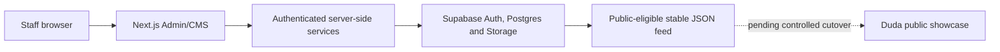

# Capstone Impact Platform

The Capstone Impact Platform is a school-owned Admin/CMS and automation layer for collecting, reviewing and publishing capstone project showcases.

Manual email, spreadsheet, poster and Duda publishing workflows are difficult to validate and repeat at scale. This project introduces structured project records, validation, review controls and a stable publishing boundary while preserving the existing public showcase as the presentation layer.

The current hybrid design is: staff operate the Admin/CMS, authenticated server-side services manage source data in Supabase, and public-eligible (`approved` and `published`) records are compiled into stable JSON for Duda. `Prototype/` is retained as historical feasibility evidence, not as the active application.

> [!IMPORTANT]
> Active development is in [`apps/admin-cms/`](./apps/admin-cms/). It is a production-oriented staging implementation. Staging operations are isolated from the live public showcase, synthetic data is required, and production cutover plus full reviewer/editor UAT remain pending.

## Why the project exists

The target workflow needs structured submissions, validation, review, archival and repeatable publishing. Moving source data and operational control into a school-owned system reduces manual duplication while allowing the established public showcase to remain the presentation surface.

## Key capabilities

| Area | Current status |
| --- | --- |
| Admin/CMS foundation | Authenticated internal shell, protected routes and operational project dashboard are implemented. |
| Project index | Server-side search, filters, whitelisted sorting, exact-count pagination and deterministic ordering are implemented. |
| Review | Project inspection and controlled `approve`, `request_changes` and `archive` actions are implemented; atomic transaction hardening remains pending. |
| Ingestion | Package parsing, metadata/file validation, import-batch tracking and import-review foundations are implemented. |
| Media and feed | Private draft storage, validated promotion foundations and public-eligible JSON feed compilation are implemented. |
| Data layer | Supabase schema, RLS and explicit grant migrations are versioned; broader production verification remains pending. |
| Quality | Offline automated tests cover domain, auth helpers, validation, feed, import, media, repository and UI-token behavior. |
| Not yet complete | Metadata editor, student confirmation, integrated preview, publishing/history and rollback UI, full manual accessibility QA, production hardening and controlled Duda cutover. |

## Architecture



Staff use the protected Next.js application. Server-side authentication and authorization mediate access to Supabase. The feed compiler removes internal fields and includes public-eligible `approved` and `published` records; all other workflow states are excluded. The architecture supports Duda as the public consumer, but staging feed output remains isolated from the live showcase until a controlled cutover.

## Repository structure

| Path | Purpose | Status |
| --- | --- | --- |
| [`apps/admin-cms/`](./apps/admin-cms/) | Active Next.js Admin/CMS application. | Active implementation and staging operations |
| [`infra/supabase/`](./infra/supabase/) | Versioned schema, RLS, grants and database runbooks. | Operational infrastructure documentation |
| [`docs/`](./docs/) | Architecture, UI, integration and project constraints. | Operational and planning documentation |
| [`Prototype/`](./Prototype/) | Earlier feasibility/demo application. | Historical evidence only |
| [`package.json`](./package.json) | Root npm workspace and convenience scripts. | Active repository contract |

## Quick start

From a fresh checkout:

1. Install dependencies.

   ```bash
   npm install
   ```

2. Start local Supabase development stack (requires Docker Desktop):

   ```bash
   npm run supabase:start
   npm run supabase:reset
   npm run supabase:env:local
   npm run supabase:users:local
   npm run supabase:verify:local
   ```

3. Start the Next.js development server:

   ```bash
   npm run dev:admin
   ```

4. Open [http://localhost:3000/login](http://localhost:3000/login) and log in using synthetic credentials from `apps/admin-cms/.local-users.json`.

For detailed local onboarding guidance, see the [Local Development Guide](./infra/supabase/local-development.md). Offline tests and the sample-feed check do not require private dashboard access or hosted database connections.

## Validation commands

Run from the repository root:

| Check | Command |
| --- | --- |
| Lint | `npm run lint --workspace=apps/admin-cms` |
| Tests | `npm run test:admin` |
| Typecheck | `npm run typecheck:admin` |
| Build | `npm run build:admin` |
| Public-feed contract | `npm run check:feed` |

## Documentation map

| Document | Role |
| --- | --- |
| [`apps/admin-cms/README.md`](./apps/admin-cms/README.md) | Authoritative developer and staging-operator guide. |
| [`docs/admin-cms-ui-system.md`](./docs/admin-cms-ui-system.md) | Current UI and information-architecture contract. |
| [`docs/duda-integration-plan.md`](./docs/duda-integration-plan.md) | Public-feed and Duda integration design/plan. |
| [`docs/prototype-notes.md`](./docs/prototype-notes.md) | Historical prototype notes; not the current application contract. |
| [`infra/supabase/README.md`](./infra/supabase/README.md) | Supabase migration and policy orientation. |
| [`infra/supabase/manual-apply-guide.md`](./infra/supabase/manual-apply-guide.md) | Authorized migration and staging operations runbook. |
| [`infra/supabase/staging-auth-verification.md`](./infra/supabase/staging-auth-verification.md) | Controlled authentication and authorization verification runbook. |

## Security and data handling

- Never commit `.env` or `.env.local` files.
- Keep server-only credentials out of browser code and Client Components.
- Autonomous agents must not access private administrative dashboards.
- Use synthetic fixtures only; real student, staff or stakeholder personal data is prohibited in staging.
- Keep `Prototype/` and staging environments isolated.
- State-changing commands, migrations, bootstrap operations and publishing require explicit authorization.

## Roadmap

Implemented foundations include the authenticated Admin/CMS shell, project index, validation, import and media workflows, Supabase migration set and public-eligible feed compiler.

Remaining work includes a metadata editor, student confirmation, preview and publication-history workflows, transaction-backed review updates, reviewer/editor UAT, accessibility and visual QA, production deployment hardening and controlled Duda cutover. Phase 4 is not represented as implemented.

This repository supports a university capstone project. No license, contribution policy or security policy is asserted here because those governance files are not currently present.
