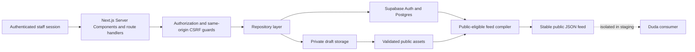

# Capstone Impact Platform — Admin/CMS

The Admin/CMS is the active Next.js application for authenticated internal administration of structured capstone project records, validation, imports, review actions, media/storage foundations and public-eligible feed compilation. It is a production-oriented staging implementation, not a production-readiness certification. See the [repository README](../../README.md) for the project-level overview.

## Scope and non-goals

The application currently owns:

- authenticated internal administration and protected Admin routes;
- structured project records, validation flags and import batches;
- package ingestion and import review;
- project inspection and controlled review transitions;
- private draft media and public-asset storage foundations;
- public-eligible stable JSON feed compilation.

It does not yet provide a completed metadata editor, student portal or final confirmation workflow, integrated preview workspace, publishing/history or rollback UI, production Duda cutover, or production-readiness certification.

## Current capability and verification

| Capability | Implemented | Verification status | Remaining limitation |
| --- | --- | --- | --- |
| Administrator authentication | Yes | Initial administrator flow verified in isolated staging | Broader provisioning and UAT remain pending |
| Reviewer/editor roles | Yes | Permission definitions and helper tests | Permission-matrix UAT pending |
| Protected Admin routes | Yes | Auth guard and route behavior covered by source/tests | Authenticated browser and screen-reader testing pending |
| Project dashboard and server-side index | Yes | Query helpers and repository behavior covered by tests | Manual responsive QA remains pending |
| Import workflow | Foundations | Import validation and batch views implemented | Browser intake UX and spreadsheet upload are not complete |
| Review transitions | Yes | Workflow tests and protected mutation route implemented | Update plus audit insert is not transaction-backed |
| Project metadata editing | No | Repository supports update operations, but no editor route/UI exists | Planned |
| Media validation/storage | Foundations | Offline media validation tests; private-to-public storage functions exist | End-to-end staging and production verification pending |
| Public-eligible feed compiler | Yes | Compiler and schema validator tests; offline feed check | Controlled public cutover pending |
| Duda integration | Design boundary | Stable-feed consumer is documented | Live Duda connection remains isolated |
| Database schema/RLS | Versioned | Migration tests and SQL contracts exist | Full production RLS verification pending |
| Automated testing | Yes | Vitest offline suite | No hosted CI evidence is asserted here |
| Production deployment | No | Not production-verified | Hardening and controlled cutover pending |

## Technology stack

| Technology | Use |
| --- | --- |
| Next.js 16 App Router | Server-rendered application, layouts and route handlers |
| React 19 | UI components |
| TypeScript 5 | Static type checking |
| Tailwind CSS 4 | Utility styling and design tokens |
| Radix UI and Lucide React | Accessible primitives and interface icons |
| TanStack Table | Table/index foundations |
| Supabase Auth, Postgres and Storage | Session, relational data, policies and assets |
| Zod | Runtime environment and input validation |
| Vitest | Offline automated tests |
| Gemini assistive extraction | Optional staging aid, disabled by default; not a required runtime dependency |

## System architecture



The browser receives only browser-safe configuration. Server code resolves the authenticated session, links it to an `admin_users` record, derives roles and permissions, and only then uses the repository or server-only Supabase client. The compiler excludes internal fields and filters for `approved` or `published` records. There is no live-preview claim in this application.

## Prerequisites

- Node.js compatible with the repository’s installed Next.js and lockfile contract; no narrower version is asserted here.
- npm with workspace support.
- An explicitly authorized isolated Supabase environment for database-backed development, staging checks and mutations.

Offline tests and the sample-feed check do not require access to a private dashboard or a staging database.

## Getting started

Run from the repository root:

1. Install dependencies.

   ```bash
   npm install
   ```

2. Copy the environment template locally.

   ```bash
   cp apps/admin-cms/.env.example apps/admin-cms/.env.local
   ```

   PowerShell:

   ```powershell
   Copy-Item apps/admin-cms/.env.example apps/admin-cms/.env.local
   ```

3. Populate the required variable names for an explicitly authorized isolated environment. The template is a blank contract: never use a production or recovery environment, and do not print or commit values from the local file.

4. Start the development server.

   ```bash
   npm run dev:admin
   ```

5. Open [`/login`](http://localhost:3000/login) locally.

Offline tests and the sample-feed check do not require private dashboard access.

## Environment reference

| Variable | Classification | Purpose |
| --- | --- | --- |
| `NEXT_PUBLIC_SUPABASE_URL` | Browser-safe | Supabase endpoint used by public client configuration. |
| `NEXT_PUBLIC_SUPABASE_PUBLISHABLE_KEY` or `NEXT_PUBLIC_SUPABASE_ANON_KEY` | Browser-safe | Public client key; one is required. |
| `SUPABASE_SECRET_KEY` or `SUPABASE_SERVICE_ROLE_KEY` | Server-only | Database administration client; one is required and must never reach browser code. |
| `SUPABASE_DRAFT_BUCKET` | Server-only | Private draft media bucket name. |
| `SUPABASE_PUBLIC_ASSETS_BUCKET` | Server-only | Approved public asset bucket name. |
| `SUPABASE_PUBLIC_FEEDS_BUCKET` | Server-only | Public feed bucket name. |
| `SUPABASE_PUBLIC_FEED_FILE` | Server-only | Stable feed object name. |
| `GEMINI_API_KEY` and `GEMINI_MODEL` | Server-side optional | Assistive extraction configuration. |
| `GEMINI_ASSISTIVE_EXTRACTION_ENABLED` | Server-side optional | Enables assistive extraction only when explicitly set to `true`. |

The runtime contract in [`src/lib/env.ts`](./src/lib/env.ts) validates required public/server configuration and classifies keys without exposing their values. `.env` and `.env.local` are ignored by Git.

## Command reference

Run these from the repository root unless noted. Read-only checks do not change application data. Seed, import, media promotion, feed publication, migration and admin-linking commands are state-changing and require explicit operator authorization.

### Development and quality

| Purpose | Root command | App command | Classification |
| --- | --- | --- | --- |
| Develop | `npm run dev:admin` | `npm run dev` | Local server |
| Lint | `npm run lint --workspace=apps/admin-cms` | `npm run lint` | Read-only |
| Tests | `npm run test:admin` | `npm run test:run` | Offline read-only |
| Typecheck | `npm run typecheck:admin` | `npm run typecheck` | Read-only |
| Build | `npm run build:admin` | `npm run build` | Local build |
| Feed contract check | `npm run check:feed` | `npm run check:sample-feed` | Offline read-only |

### Read-only staging checks

| Purpose | Root command | App command | Classification |
| --- | --- | --- | --- |
| Staging project check | `npm run check:admin-staging` | `npm run check:staging-projects` | Authorized read-only database check |
| Staging media check | `npm run check:admin-media` | `npm run check:staging-media` | Authorized read-only database/storage check |
| Auth check | `npm run check:admin-auth` | `npm run check:staging-auth` | Authorized read-only database check |
| Import-batch check | `npm run check:admin-imports` | `npm run check:import-batches` | Authorized read-only database check |

### State-changing staging operations

> [!WARNING]
> State-changing operations require explicit authorization and must target only the approved isolated staging environment.

| Purpose | Root command | App command | Classification |
| --- | --- | --- | --- |
| Seed fake projects | `npm run seed:admin-staging` | `npm run seed:staging` | State-changing; synthetic data only |
| Seed/promote fake media | `npm run seed:admin-media` | `npm run seed:staging-media` | State-changing; synthetic data only |
| Import local package | `npm run import:admin-package` | `npm run import:staging-package` | State-changing; authorized fixture operation |
| Publish staging feed | `npm run publish:admin-feed` | `npm run publish:staging-feed` | State-changing; authorized staging operation |
| Link initial administrator | `npm run link:admin-staging` | `npm run link:staging-admin` | State-changing; use the auth runbook |

Do not blindly reinitialize an already-applied environment. Use the [Supabase migration guide](../../infra/supabase/manual-apply-guide.md) for a genuinely new authorized isolated environment and never target `Prototype/` or a recovery environment.

## Database and migrations

The migration set is manually governed for authorized isolated environments. It must never target `Prototype/`, recovery or unrelated environments, and an already provisioned environment must not be blindly reinitialized. Production migration delivery and verification remain pending.

- [`20260601035138_staging_schema.sql`](../../infra/supabase/migrations/20260601035138_staging_schema.sql) defines the relational schema, constraints, indexes and timestamps.
- [`20260601035139_staging_rls_policies.sql`](../../infra/supabase/migrations/20260601035139_staging_rls_policies.sql) establishes the restrictive Row-Level Security baseline.
- [`20260715102956_admin_auth_identity.sql`](../../infra/supabase/migrations/20260715102956_admin_auth_identity.sql) links Admin/CMS users with Supabase Auth identities.
- [`20260719003407_explicit_data_api_grants.sql`](../../infra/supabase/migrations/20260719003407_explicit_data_api_grants.sql) adds explicit least-privilege Data API grants.
- [`20260719165118_initial_admin_bootstrap.sql`](../../infra/supabase/migrations/20260719165118_initial_admin_bootstrap.sql) adds the guarded initial-admin bootstrap function.
- [`20260719165119_fix_initial_admin_bootstrap_runtime.sql`](../../infra/supabase/migrations/20260719165119_fix_initial_admin_bootstrap_runtime.sql) corrects the bootstrap runtime migration.

See the [Supabase migration overview](../../infra/supabase/README.md), [manual apply guide](../../infra/supabase/manual-apply-guide.md) and [staging authentication verification runbook](../../infra/supabase/staging-auth-verification.md) before authorized operations.

## Authentication and authorization

Authentication uses a Supabase Auth session. The server-only `requireAdmin` helper reads claims, resolves the linked `admin_users` record, loads recognized roles from `user_roles`, derives permissions and returns generic public errors for unauthenticated, unprovisioned or denied access. The `/admin` layout protects the page tree; the project collection API and review mutation authorize independently.

Review mutations also require a same-origin `Origin` header. Audit attribution is derived from the authenticated server-side admin context rather than a trusted browser identity. Raw backend errors are logged for developers but sanitized before staff-facing responses.

### Role-based access control

| Role | Read | Edit metadata | Review | Archive | Verification status |
| --- | --- | --- | --- | --- | --- |
| `admin` | Yes | Yes | Yes | Yes | Initial role operationally verified in isolated staging |
| `reviewer` | Yes | No | Yes | No | Definition and helpers tested; UAT pending |
| `editor` | Yes | Yes | No | No | Definition and helpers tested; UAT pending |

## Application routes

| Route | Access | Purpose | Current maturity |
| --- | --- | --- | --- |
| `/login` | Public | Sign in and safe redirect handling. | Implemented |
| `/auth/confirm` | Public token flow | Accept invitation confirmation and establish a protected handoff. | Implemented; operational UAT remains bounded |
| `/auth/confirm/accept` | Invitation session | Complete the invitation acceptance step. | Implemented |
| `/auth/set-password` | Invitation session | Set a password, then terminate the invitation session. | Implemented |
| `/admin` | Authenticated provisioned Admin/CMS staff | Dashboard metrics, filters, search, sorting and pagination. | Implemented; manual UI QA pending |
| `/admin/projects/[publicId]` | Authenticated provisioned Admin/CMS staff | Inspect a project and access controlled review actions. | Implemented; editor and preview UI pending |
| `/admin/imports` | Authenticated provisioned Admin/CMS staff | List import batches and validation summaries. | Implemented |
| `/admin/imports/[batchId]` | Authenticated provisioned Admin/CMS staff | Inspect a batch, linked project and validation flags. | Implemented |

There is no implemented student project-confirmation workflow or route, metadata editor, publishing-history route, or settings route.

## API routes

| Method | Route | Authorization | Purpose | Mutation |
| --- | --- | --- | --- | --- |
| `GET` | `/api/health` | Public | Returns safe configuration classifications and staging flags. | No |
| `GET` | `/api/projects` | `requireAdmin` plus `projects.read` | Returns the protected project collection. | No |
| `POST` | `/api/projects/[publicId]/review-action` | Same-origin check, `requireAdmin`, then review/archive permission | Validates and applies `request_changes`, `approve` or `archive`. | Yes |

No metadata `PATCH` route is currently implemented.

## Project workflow

The domain represents `draft`, `submitted`, `in_review`, `changes_requested`, `approved`, `published`, `archived` and `deleted` statuses. The review API currently supports these transitions:

| Current status | Supported action | Result |
| --- | --- | --- |
| `submitted`, `in_review` | `request_changes` | `changes_requested` |
| `submitted`, `in_review` | `approve` | `approved` |
| `submitted`, `in_review` | `archive` | `archived` |
| `changes_requested` | `approve` | `approved` |
| `approved` | `request_changes` | `changes_requested` |
| `approved` | `archive` | `archived` |
| `published` | `archive` | `archived` |

`draft`, `archived` and `deleted` have no review actions in the current workflow helper. Student confirmation, automatic publishing and Duda synchronization are future concepts, not current behavior.

The current mutation updates the project and then inserts an approval record. Because those operations are not yet transaction-backed, production hardening is required before real operational use.

## Project dashboard and index

The dashboard uses count-only metrics for total, public-eligible, in-review and archived records. Its project index parses bounded search input, supports server-side status/year/program/discipline filters, whitelisted sorting, exact-count pagination with page sizes of 10, 25 or 50, and deterministic `public_id` secondary ordering. The UI has separate loading, empty and failure states and maintains a client-safe row boundary for interactive index controls.

## Import workflow

The current fixture-based importer reads a local package containing a `project.json` manifest and supported poster/snapshot assets. It validates required metadata, file names, MIME types, size bounds and path safety, creates or updates an import batch, records validation flags, creates the project in `in_review`, and uploads imported assets as private drafts. The import list and batch detail routes expose the resulting status, warnings, errors, linked project and staged media.

This is an ingestion foundation, not a finished browser submission process. Browser file upload and automated spreadsheet intake are not implemented.

## Media and storage lifecycle

Media validation permits PNG, JPEG, WEBP and PDF assets, with images capped at 5 MB and PDFs at 20 MB. Draft uploads use private storage and receive no public URL. An explicit promotion function downloads a draft, uploads it to the public-assets bucket, creates a public URL and updates the media record as approved. External video links remain metadata; video binaries are not uploaded by this workflow.

Promotion and feed publication are separate authorized operations. Staging code does not establish a live production connection to Duda.

## Public feed and Duda boundary

The feed compiler includes only `approved` and `published` records and validates the resulting stable JSON contract. It excludes internal staff notes, review comments, validation internals, archive metadata and other CMS-only fields. Supabase Storage provides the publication foundation; Duda is the intended presentation consumer. The [Duda integration plan](../../docs/duda-integration-plan.md) is a design/operations reference, and live cutover remains pending and isolated from staging.

## Testing and quality gates

Canonical checks:

```bash
npm run lint --workspace=apps/admin-cms
npm run test:admin
npm run typecheck:admin
npm run build:admin
npm run check:feed
git diff --check
```

The offline suite covers authentication and authorization helpers, workflow transitions, project and import validation, feed compilation and validation, media safety, project-query parsing, repository query behavior, invitation/password flows and design-token contrast. Automated offline coverage is distinct from staging UAT. Hosted CI evidence, authenticated browser regression, full screen-reader validation and production deployment verification are not asserted here.

## Security and privacy boundaries

- Never commit `.env` or `.env.local`; do not copy values into issues, logs or documentation.
- Public environment variables are browser-safe; database administration keys and optional assistive-extraction keys are server-only.
- Client Components never receive a service-role or secret-key client.
- Use synthetic fixtures only. Real student, staff and stakeholder personal data is prohibited in staging.
- Keep `Prototype/`, recovery environments and the active staging environment isolated.
- Migrations, seed/import/promotion/publication scripts and admin linking are state-changing and require explicit authorization.
- Actor identity and audit attribution come from the server-side authenticated context.
- Public feed payloads exclude internal fields.
- Staff-facing responses use sanitized errors; raw backend details are not rendered.

## Known limitations and production gaps

- No completed metadata editor.
- Reviewer/editor permission-matrix UAT remains pending.
- Project detail is the next major UI modernization area.
- Review update and audit insertion are not transaction-backed.
- Student confirmation, integrated preview, publishing history and rollback UI are pending.
- Live Duda cutover is pending.
- Authenticated browser, responsive, accessibility and screen-reader validation remain incomplete.
- Production deployment hardening and readiness certification remain pending.

## Troubleshooting

| Symptom | Safe next step |
| --- | --- |
| Missing environment configuration | Copy the template locally, verify variable names against [`src/lib/env.ts`](./src/lib/env.ts), and never disclose values. |
| Build or typecheck failure | Run the failing command from the repository root and inspect the first actionable diagnostic; do not change environment secrets to suppress it. |
| Authentication not provisioned | Follow [`staging-auth-verification.md`](../../infra/supabase/staging-auth-verification.md); admin linking is an explicitly authorized mutation. |
| Missing migration baseline | Follow [`manual-apply-guide.md`](../../infra/supabase/manual-apply-guide.md) for a new authorized isolated environment; do not blindly reinitialize an applied environment. |
| Staging database unavailable | Confirm the authorized environment and local configuration with the operator; offline tests and feed checks remain available without it. |
| Projects or imports do not appear | Use the read-only check scripts, inspect the relevant batch/status and review sanitized application errors; do not seed, delete or reset data by default. |

## Related documentation

- [Repository README](../../README.md)
- [Admin/CMS UI system](../../docs/admin-cms-ui-system.md)
- [Duda integration plan](../../docs/duda-integration-plan.md)
- [Supabase migration overview](../../infra/supabase/README.md)
- [Supabase manual apply guide](../../infra/supabase/manual-apply-guide.md)
- [Staging authentication verification](../../infra/supabase/staging-auth-verification.md)
