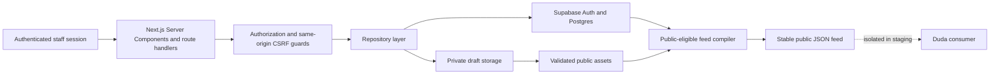

# Capstone Impact Platform — Admin/CMS

The Admin/CMS is the active Next.js application for authenticated internal administration of structured capstone project records, validation, imports, review actions, media/storage foundations and public-eligible feed compilation. It is a production-oriented staging implementation, not a production-readiness certification. See the [repository README](../../README.md) for the project-level overview.

## Scope and non-goals

The application currently owns:

- authenticated internal administration and protected Admin routes;
- structured project records, validation flags and import batches;
- package ingestion and import review;
- project inspection and controlled review transitions;
- private draft media and public-asset storage foundations;
- public-eligible stable JSON feed compilation.

It includes a project metadata editor backed by one atomic, service-role-only database transaction. Hosted deployment and broader staff acceptance remain separate activities. Browser Back/Forward interception is not supported or claimed. It does not yet provide a participant portal or final confirmation workflow, integrated preview workspace, publishing/history or rollback UI, production Duda cutover, or production-readiness certification.

## Current capability and verification

| Capability | Implemented | Verification status | Remaining limitation |
| --- | --- | --- | --- |
| Administrator authentication | Yes | Initial administrator flow verified in isolated staging | Broader provisioning and UAT remain pending |
| Reviewer/editor roles | Yes | Permission definitions and helper tests | Permission-matrix UAT pending |
| Protected Admin routes | Yes | Auth guard and route behavior covered by source/tests | Authenticated browser and screen-reader testing pending |
| Project dashboard and server-side index | Yes | Query helpers and repository behavior covered by tests | Manual responsive QA remains pending |
| Import workflow | Yes | Browser import preview, metadata/media staging, and mapping-driven Admin Excel reference reconciliation foundation verified | Server-side reconciliation and replay verified; multi-batch analytics pending |
| Review transitions | Yes | Workflow tests, static contract tests, and atomic RPC performReviewAction route implemented | Full reviewer/editor UAT pending |
| Project metadata editing | Yes | Editor route/UI and one atomic metadata RPC are implemented locally | Hosted deployment and broader staff acceptance remain separate |
| Media validation/storage | Foundations | Offline media validation tests; private-to-public storage functions exist | End-to-end staging and production verification pending |
| Public-eligible feed compiler | Yes | Compiler and schema validator tests; offline feed check | Controlled public cutover pending |
| Duda integration | Design boundary | Stable-feed consumer is documented | Live Duda connection remains isolated |
| Database schema/RLS | Versioned | Migration tests and SQL contracts exist (24 timestamped migrations; migrations 0007 through 0024 repository/local-only) | Full production RLS verification pending |
| Automated testing | Yes | Vitest offline suite and onboarding precheck | No hosted CI evidence is asserted here |
| Production deployment | No | Not production-verified | Hardening and controlled cutover pending |

## Technology stack

| Technology | Use |
| --- | --- |
| Next.js 16 App Router | Server-rendered application, layouts and route handlers |
| React 19 | UI components |
| TypeScript 5 | Static type checking |
| Tailwind CSS 4 | Utility styling and design tokens |
| Radix UI and Lucide React | Accessible primitives and interface icons |
| TanStack Table | Table/index foundations |
| Supabase Auth, Postgres and Storage | Session, relational data, policies and assets |
| Zod | Runtime environment and input validation |
| Vitest | Offline automated tests |
| Gemini assistive extraction | Optional staging aid, disabled by default; not a required runtime dependency |

## System architecture


```mermaid
flowchart LR
    A[Authenticated staff session] --> B[Next.js Server Components and route handlers]
    B --> C[Authorization and same-origin CSRF guards]
    C --> D[Repository layer]
    D --> E[Supabase Auth and Postgres]
    D --> F[Private draft storage]
    F --> G[Validated public assets]
    E --> H[Public-eligible feed compiler]
    G --> H
    H --> I[Stable public JSON feed]
    I -. isolated in staging .-> J[Duda consumer]
```

The browser receives only browser-safe configuration. Server code resolves the authenticated session, links it to an `admin_users` record, derives roles and permissions, and only then uses the repository or server-only Supabase client. Modern server key preference (`SUPABASE_SECRET_KEY` preferred with `SUPABASE_SERVICE_ROLE_KEY` fallback) is enforced on server administrative clients, while `NEXT_PUBLIC_SUPABASE_PUBLISHABLE_KEY` is preferred for browser clients. The compiler excludes internal fields and filters for `approved` or `published` records. There is no live-preview claim in this application.

## Prerequisites

- **Node.js**: `>= 24.14.1 < 25` (Pinned via root `.nvmrc` to `24.14.1`).
- **npm**: `>= 11.11.0 < 12` (Declared in `packageManager` as `npm@11.11.0`).
- Docker Desktop or Docker Engine (running locally for Supabase containers; no cloud account required for local development).
- An explicitly authorized isolated Supabase environment for database-backed staging checks and operations.

For contributor rules and environment guidelines, see [`CONTRIBUTING.md`](../../CONTRIBUTING.md). Offline tests, the sample-feed check (`npm run check:feed`), and the onboarding precheck (`npm run onboarding:check`) do not require access to a private dashboard or a staging database.

## Getting started

Run from the repository root:

1. Clean install dependencies:

   ```bash
   npm ci
   ```

2. One-command local developer setup:

   ```bash
   npm run setup:local
   ```

3. Start the development server:

   ```bash
   npm run dev:admin
   ```

4. Open [`/login`](http://localhost:3000/login) locally.

5. Clean up when finished:

   ```bash
   npm run supabase:stop
   ```

*(Note: Advanced diagnostic or manual setup subcommands `supabase:start`, `supabase:seed:buckets`, `supabase:env:local`, `supabase:users:local`, and `supabase:verify:local` are described in the [Local Development Guide](../../infra/supabase/local-development.md). Offline tests and the sample-feed check do not require private dashboard access.)*

## Environment reference

| Variable | Classification | Purpose |
| --- | --- | --- |
| `CAPSTONE_RUNTIME_ENV` | Target Guard | Target environment identifier. Staging-capable commands require the exact value `staging`. Local Supabase workflows do not use this shared-staging identity guard (local workflows are protected separately by loopback-only validation). |
| `CAPSTONE_EXPECTED_SUPABASE_HOST` | Target Guard | Expected Supabase host domain (e.g. `app-staging.supabase.co`). Required for staging target matching. |
| `NEXT_PUBLIC_SUPABASE_URL` | Browser-safe | Supabase endpoint used by public client configuration. |
| `NEXT_PUBLIC_SUPABASE_PUBLISHABLE_KEY` | Browser-safe | Modern publishable client key (preferred over legacy `NEXT_PUBLIC_SUPABASE_ANON_KEY`). |
| `SUPABASE_SECRET_KEY` | Server-only | Modern server secret key (preferred over legacy `SUPABASE_SERVICE_ROLE_KEY`). Must never reach browser code. |
| `SUPABASE_SERVICE_ROLE_KEY` | Server-only | Temporary legacy fallback server key. |
| `SUPABASE_DRAFT_BUCKET` | Server-only | Private draft media bucket name. |
| `SUPABASE_PUBLIC_ASSETS_BUCKET` | Server-only | Approved public asset bucket name. |
| `SUPABASE_PUBLIC_FEEDS_BUCKET` | Server-only | Public feed bucket name. |
| `SUPABASE_PUBLIC_FEED_FILE` | Server-only | Stable feed object name. |
| `GEMINI_API_KEY` and `GEMINI_MODEL` | Server-side optional | Assistive extraction configuration. |
| `GEMINI_ASSISTIVE_EXTRACTION_ENABLED` | Server-side optional | Enables assistive extraction only when explicitly set to `true`. |
| `STAFF_PROVISIONING_ENABLED` | Server-only optional | Enables creation of new staff invitations only when explicitly set to `true`. Fails closed when absent. Never gates activation of an existing pending invitation. |
| `PARTICIPANT_PREVIEW_EMAIL_ENABLED` | Server-only optional | Enables participant preview email delivery only when explicitly set to `true`. Fails closed when absent. |
| `PARTICIPANT_PREVIEW_EMAIL_SMTP_HOST`, `PARTICIPANT_PREVIEW_EMAIL_SMTP_PORT`, `PARTICIPANT_PREVIEW_EMAIL_SMTP_SECURE` | Server-only optional | SMTP endpoint for participant preview email. Incomplete or invalid configuration means disabled. |
| `PARTICIPANT_PREVIEW_EMAIL_SMTP_USER`, `PARTICIPANT_PREVIEW_EMAIL_SMTP_PASSWORD` | Server-only optional | SMTP credentials. Required together or not at all; a username without a password means disabled. |
| `PARTICIPANT_PREVIEW_EMAIL_FROM` | Server-only optional | From address for participant preview email. Required when delivery is enabled. |
| `PARTICIPANT_PREVIEW_REMINDERS_ENABLED` | Server-only optional | Enables due-reminder claiming only when explicitly set to `true`. Scheduling also requires complete participant-preview email configuration. Absent or invalid configuration fails closed. |

The runtime contract in [`src/lib/env.ts`](./src/lib/env.ts) validates required public/server configuration and classifies keys without exposing their values. `.env` and `.env.local` are ignored by Git.

## Command reference

Run these from the repository root unless noted. Read-only checks do not change application data. Seed, import, media promotion, feed publication, migration and admin-linking commands are state-changing and require explicit operator authorization.

### Development and quality

| Purpose | Root command | App command | Classification |
| --- | --- | --- | --- |
| Onboarding Precheck | `npm run onboarding:check` | `npm run check:onboarding` | Read-only local toolchain & security check |
| Develop | `npm run dev:admin` | `npm run dev` | Local server |
| Lint | `npm run lint --workspace=apps/admin-cms` | `npm run lint` | Read-only |
| Tests | `npm run test:admin` | `npm run test:run` | Offline read-only |
| Typecheck | `npm run typecheck:admin` | `npm run typecheck` | Read-only |
| Build | `npm run build:admin` | `npm run build` | Local build |
| Feed contract check | `npm run check:feed` | `npm run check:sample-feed` | Pure offline read-only fixture execution |

### Read-only staging checks

Read-only staging checks require validated staging runtime identity (`CAPSTONE_RUNTIME_ENV=staging`, `CAPSTONE_EXPECTED_SUPABASE_HOST`) and exact host matching. They perform zero database/storage mutations and reject mutation acknowledgment flags.

| Purpose | Root command | App command | Classification |
| --- | --- | --- | --- |
| Staging project check | `npm run check:admin-staging` | `npm run check:staging-projects` | Authorized read-only database check |
| Staging media check | `npm run check:admin-media` | `npm run check:staging-media` | Authorized read-only database/storage check |
| Auth check | `npm run check:admin-auth` | `npm run check:staging-auth` | Authorized read-only database check |
| Import-batch check | `npm run check:admin-imports` | `npm run check:import-batches` | Authorized read-only database check |

### State-changing staging operations

> [!WARNING]
> DO NOT RUN UNTIL THE PROJECT OWNER APPROVES THE SPECIFIC OPERATION.
> State-changing operations require explicit operator authorization, target environment identity validation (`CAPSTONE_RUNTIME_ENV=staging`), and double-acknowledgment flags (`--apply` and `--confirm-staging=capstone-admin-cms-staging-2026`). Missing acknowledgment flags cause refusal before Supabase admin-client creation.
> Administrator linking additionally requires process environment variable `CAPSTONE_BOOTSTRAP_CONFIRM=LINK_EXISTING_STAGING_ADMIN`.

| Purpose | Complete Root Command | App Command | Classification |
| --- | --- | --- | --- |
| Seed fake projects | `npm run seed:admin-staging -- --apply --confirm-staging=capstone-admin-cms-staging-2026` | `npm run seed:staging -- --apply --confirm-staging=capstone-admin-cms-staging-2026` | State-changing; synthetic data only |
| Seed/promote fake media | `npm run seed:admin-media -- --apply --confirm-staging=capstone-admin-cms-staging-2026` | `npm run seed:staging-media -- --apply --confirm-staging=capstone-admin-cms-staging-2026` | State-changing; synthetic data only |
| Import local package | `npm run import:admin-package -- --apply --confirm-staging=capstone-admin-cms-staging-2026` | `npm run import:staging-package -- --apply --confirm-staging=capstone-admin-cms-staging-2026` | State-changing; authorized fixture operation |
| Publish staging feed | `npm run publish:admin-feed -- --apply --confirm-staging=capstone-admin-cms-staging-2026` | `npm run publish:staging-feed -- --apply --confirm-staging=capstone-admin-cms-staging-2026` | State-changing; authorized staging operation |
| Link initial administrator | `npm run link:admin-staging -- --apply --confirm-staging=capstone-admin-cms-staging-2026` | `npm run link:staging-admin -- --apply --confirm-staging=capstone-admin-cms-staging-2026` | State-changing; requires `CAPSTONE_BOOTSTRAP_CONFIRM=LINK_EXISTING_STAGING_ADMIN` |

Do not blindly reinitialize an already-applied environment. Use the [Supabase migration guide](../../infra/supabase/manual-apply-guide.md) for a genuinely new authorized isolated environment and never target `Prototype/` or a recovery environment.

## Database and migrations

The migration set is manually governed for authorized isolated environments. It must never target `Prototype/`, recovery or unrelated environments, and an already provisioned environment must not be blindly reinitialized. Production migration delivery and verification remain pending.

- [`20260601035138_staging_schema.sql`](../../infra/supabase/migrations/20260601035138_staging_schema.sql) defines the relational schema, constraints, indexes and timestamps.
- [`20260601035139_staging_rls_policies.sql`](../../infra/supabase/migrations/20260601035139_staging_rls_policies.sql) establishes the restrictive Row-Level Security baseline.
- [`20260715102956_admin_auth_identity.sql`](../../infra/supabase/migrations/20260715102956_admin_auth_identity.sql) links Admin/CMS users with Supabase Auth identities.
- [`20260719003407_explicit_data_api_grants.sql`](../../infra/supabase/migrations/20260719003407_explicit_data_api_grants.sql) adds explicit least-privilege Data API grants.
- [`20260719165118_initial_admin_bootstrap.sql`](../../infra/supabase/migrations/20260719165118_initial_admin_bootstrap.sql) adds the guarded initial-admin bootstrap function.
- [`20260719165119_fix_initial_admin_bootstrap_runtime.sql`](../../infra/supabase/migrations/20260719165119_fix_initial_admin_bootstrap_runtime.sql) corrects the bootstrap runtime migration.
- [`20260803174000_harden_function_execute_defaults.sql`](../../infra/supabase/migrations/20260803174000_harden_function_execute_defaults.sql) establishes function execution default privilege revokes and RLS helper guard. *(Committed in repository; local/repository-only; not yet applied to hosted staging.)*
- [`20260803180000_transactional_review_actions.sql`](../../infra/supabase/migrations/20260803180000_transactional_review_actions.sql) establishes atomic `public.perform_project_review_action` PostgreSQL RPC function for transaction-backed project review status updates and audit logging. *(Committed in repository; local/repository-only; not yet applied to hosted staging.)*
- [`20260808170000_transactional_project_metadata_update.sql`](../../infra/supabase/migrations/20260808170000_transactional_project_metadata_update.sql) establishes one atomic, service-role-only `public.update_project_metadata` transaction for metadata scalar and mapping writes. *(Repository/local-only; not applied to hosted staging.)*
- [`20260810090000_atomic_browser_import_metadata_stage.sql`](../../infra/supabase/migrations/20260810090000_atomic_browser_import_metadata_stage.sql) establishes the `browser_import_commits` idempotency ledger and the atomic, service-role-only `public.stage_browser_import_metadata` transaction for browser folder-import metadata staging. *(Repository/local-only; not applied to hosted staging.)*
- [`20260810120000_atomic_browser_import_media_stage.sql`](../../infra/supabase/migrations/20260810120000_atomic_browser_import_media_stage.sql) establishes `media_assets` idempotency uniqueness, the `browser_import_media_commits` ledger, and the atomic, service-role-only `public.finalize_browser_import_media_stage` transaction that registers private draft media and completes an import batch. *(Repository/local-only; not applied to hosted staging.)*
- [`20260813002154_project_metadata_audit_history.sql`](../../infra/supabase/migrations/20260813002154_project_metadata_audit_history.sql) introduces the comprehensive project metadata audit trail, recording granular diffs, actor identity, and change intent directly into `approval_records` on every atomic metadata save. *(Repository/local-only; not applied to hosted staging.)*
- [`20260813120000_staff_identity_provisioning.sql`](../../infra/supabase/migrations/20260813120000_staff_identity_provisioning.sql) establishes the durable staff provisioning state machine and a two-minute, token-fenced execution lease for the service-role-only functions that converge Supabase Auth with PostgreSQL. Only the current execution owner may invite, bind, finalize, fail or begin compensation; expired work is recovered by rotating hashed ownership credentials. *(Repository/local-only; not applied to hosted staging.)*

See the [Supabase migration overview](../../infra/supabase/README.md), [manual apply guide](../../infra/supabase/manual-apply-guide.md), [staging reconciliation runbook](../../infra/supabase/staging-reconciliation-runbook.md) and [staging authentication verification runbook](../../infra/supabase/staging-auth-verification.md) before authorized operations.

## Authentication and authorization

Authentication uses a Supabase Auth session. The server-only `requireAdmin` helper reads claims, resolves the linked `admin_users` record, loads recognized roles from `user_roles`, derives permissions and returns generic public errors for unauthenticated, unprovisioned or denied access. The `/admin` layout protects the page tree; the project collection API and review mutation authorize independently.

Review mutations also require a same-origin `Origin` header. Audit attribution is derived from the authenticated server-side admin context rather than a trusted browser identity. Application code catches database exceptions and logs controlled internal error codes (e.g. `REVIEW_PERMISSION_DENIED`, `REVIEW_TRANSITION_INVALID`); raw database messages do not escape the repository boundary or reach HTTP responses.

### Role-based access control

| Role | Read | Edit metadata | Review | Archive | Manage staff | Verification status |
| --- | --- | --- | --- | --- | --- | --- |
| `admin` | Yes | Yes | Yes | Yes | Yes | Initial role operationally verified in isolated staging |
| `reviewer` | Yes | No | Yes | No | No | Definition and helpers tested; UAT pending |
| `editor` | Yes | Yes | No | No | No | Definition and helpers tested; UAT pending |

Recognized roles and the resulting permission union are reported in one canonical, repository-defined order (`admin`, `reviewer`, `editor`), so resolved authority never depends on database row ordering. An unrecognized role row is discarded and can never expand authority.

### Staff identity provisioning

An administrator holding `staff.manage` can invite additional Admin/CMS staff from `/admin/staff`. Provisioning uses the Supabase Auth invitation mechanism: Supabase Auth sends the invite link through the configured provider and template, and the invitee sets their own password through `/auth/confirm` → `/auth/set-password`. The application never manually generates or stores invite credentials, and raw invite credentials are never logged, persisted in application tables or rendered in the Admin/CMS. An invited identity holds a staff profile and role rows but stays **fail-closed** in `requireAdmin` until activation completes.

Creating new invitations is gated by the server-only `STAFF_PROVISIONING_ENABLED` environment variable, which fails closed when absent. Completing activation of an already-valid pending invitation is deliberately never gated by it, so disabling provisioning cannot strand an invited staff member.

Supabase Auth and PostgreSQL cannot share a transaction, so provisioning runs as an explicit convergence state machine (Migration 0022). A database-validated marker is consumed during the Auth insert and replaced with a one-way lifecycle hash in server-controlled Auth app metadata. Compensation may remove only an identity carrying that exact marker; email and creation time are never sufficient ownership proof, so pre-existing or unrelated accounts are never deleted. If compensation itself cannot complete, the attempt is recorded as `compensation_failed` and surfaced in the Admin/CMS rather than reported as success.

Institutional approval for production use, an approved production SMTP/email arrangement, hosted multi-user acceptance and human staff UAT all remain pending. `bootstrap_initial_admin` is unchanged and remains restricted to the first administrator.

### Participant preview email notification

Staff holding participant-preview authority may explicitly choose **Generate preview and send email**. Sending is never automatic: no page load, approval, correction resolution or readiness change triggers it.

**Authoritative recipient.** The destination is always `projects.participant_contact_email`, resolved server-side from persisted project data at execution time. It arrives through the canonical import path (`Participant contact email` in `project-details.xlsx` → workbook parser → `stage_browser_import_metadata`) and is normalized to trimmed lowercase by the database. The browser cannot supply, override, add or copy a recipient: the request body accepts only the `isCorrectionReissue` and `sendEmail` intent flags, and any attempt to include a destination, actor or credential field is rejected with `400` before any state change. Missing and invalid contacts fail closed with `PARTICIPANT_EMAIL_MISSING` / `PARTICIPANT_EMAIL_INVALID` **before** anything is generated.

**Token non-persistence.** The existing preview security property is unchanged: the raw token is generated server-side, only its SHA-256 hash reaches the database, and the raw value is returned exactly once. The secure URL is assembled in server memory and exists only there, in the outgoing message, and in that one-time response. It is never persisted, never logged, and never recoverable. A preview generated **without** email therefore cannot be emailed later — the Admin/CMS says so plainly rather than offering an action that cannot work. Staff who need an emailed link revoke and issue a new preview through the ordinary lifecycle.

**Atomic Generate + Send.** One PostgreSQL transaction (Migration 0023) validates the recipient, creates the preview from its hash alone, and reserves a delivery lifecycle bound to that exact `participant_preview_id`. Either all three exist afterwards or none does, so an active preview whose one-time credential has already evaporated can never be left without a delivery lifecycle.

**Delivery state machine.** PostgreSQL and SMTP cannot share a transaction, so the ledger records what is actually known: `reserved → transport_started → sent`, plus `failed` (reliable refusal, or transport provably never began) and `delivery_unknown` (the message may have gone out; acceptance cannot be proven). Execution ownership is a hashed two-minute lease; terminal states are immutable, so a stale owner can only observe them. An expired lease never re-grants execution, and an ambiguous outcome is never automatically resent. **Exactly-once delivery is not claimed** — generic SMTP cannot provide it. What is guaranteed is one authoritative lifecycle per exact preview, at most one ordinary transport invocation per claimed lifecycle, and deterministic convergence of duplicate sequential and concurrent requests.

**Enablement.** Real delivery is disabled by default. It requires `PARTICIPANT_PREVIEW_EMAIL_ENABLED=true` **and** complete, valid SMTP configuration; anything partial or unparseable means disabled, and Generate + Send then fails closed with `EMAIL_DELIVERY_DISABLED` without generating a preview. Verification is Local/disposable only, against the Local email sink that the pinned Supabase stack already ships. **Still pending: institutional/provider approval, production SMTP or provider selection, production credentials, an approved From address and domain, institutional email policy, hosted/staging rollout, and human UAT.**

### Participant preview reminder scheduling

Authorized Admin/Reviewer staff may choose an explicit future time for the exact active preview from the existing Participant Preview panel. Scheduling requires that preview's initial notification to be definitively `sent`; the time must be after server time and before the unchanged preview expiry. The server derives the exact preview, initial notification, recipient snapshot, and staff actor. Repeated submissions for the same preview and instant converge, and a still-scheduled reminder can be cancelled idempotently. Staff can see current and historical schedule, skip, cancellation, and linked delivery outcomes without seeing database IDs or execution credentials.

Migration 0024 separates future planning from email execution. `participant_preview_reminder_schedules` records `scheduled → triggered`, `skipped`, or `cancelled`; only when a bounded trusted runner claims due work does it create a short-lived `notification_kind = reminder` ledger row. `FOR UPDATE SKIP LOCKED`, a semantic schedule uniqueness constraint, and unique schedule-to-notification linkage make PostgreSQL the concurrency boundary. The runner revalidates confirmation, correction, revocation, expiry, supersession, project state, initial-delivery evidence, and the current normalized contact both when claiming and immediately before SMTP. Ineligible work is durably skipped with zero mail. A changed contact sends to neither the old nor new address.

Reminder bodies deliberately have no URL input. They tell the participant to use the secure link in the original preview email, because the raw preview credential remains non-persistent and unrecoverable. Text and HTML rendering preserve escaping, CRLF/header sanitization, bounded subjects, and the existing opaque Message-ID design. Delivery reuses the same conservative notification state machine: `sent`, known `failed`, and `delivery_unknown` are terminal and never automatically retried.

`PARTICIPANT_PREVIEW_REMINDERS_ENABLED=true`, participant-preview email enablement, and valid SMTP configuration are all required before the runner claims work. `npm run run:participant-preview-reminders` is a loopback-Supabase-only local/disposable entrypoint; the reusable core has no Mailpit dependency and can be called later by an approved production scheduler. **No production cadence, hosted scheduler/provider activation, production credential, or arbitrary resend policy is included.**

## Application routes

| Route | Access | Purpose | Current maturity |
| --- | --- | --- | --- |
| `/login` | Public | Sign in and safe redirect handling. | Implemented |
| `/auth/confirm` | Public token flow | Accept invitation confirmation and establish a protected handoff. | Implemented; operational UAT remains bounded |
| `/auth/confirm/accept` | Invitation session | Complete the invitation acceptance step. | Implemented |
| `/auth/set-password` | Invitation session | Set a password, then terminate the invitation session. | Implemented |
| `/admin` | Authenticated provisioned Admin/CMS staff | Dashboard metrics, filters, search, sorting and pagination. | Implemented; manual UI QA pending |
| `/admin/projects/[publicId]` | Authenticated provisioned Admin/CMS staff | Inspect a project, edit metadata, and access controlled review actions. | Implemented; hosted deployment and broader staff acceptance remain separate |
| `/admin/imports` | Authenticated provisioned Admin/CMS staff | List import batches and validation summaries. | Implemented |
| `/admin/imports/[batchId]` | Authenticated provisioned Admin/CMS staff | Inspect a batch, linked project and validation flags. | Implemented |
| `/admin/staff` | `requireAdmin` plus `staff.manage` | Invite Admin/CMS staff and review current access and incomplete provisioning attempts. | Implemented locally; institutional rollout and staff UAT pending |

There is no implemented participant project-confirmation workflow or route, publishing-history route, or settings route. The metadata editor is implemented locally; hosted deployment and broader staff acceptance remain separate activities.

## API routes

| Method | Route | Authorization | Purpose | Mutation |
| --- | --- | --- | --- | --- |
| `GET` | `/api/health` | Public | Returns safe configuration status classifications only. | No |
| `GET` | `/api/projects` | `requireAdmin` plus `projects.read` | Returns the protected project collection. | No |
| `POST` | `/api/projects/[publicId]/review-action` | Same-origin check, `requireAdmin`, then review/archive permission | Validates and applies `request_changes`, `approve` or `archive`. | Yes |
| `POST` | `/api/staff/invitations` | Same-origin check, `requireAdmin`, then `staff.manage` | Creates a controlled staff provisioning invitation. Accepts only the target name, email and roles; all actor attribution is server-derived. | Yes |
| `POST`, `DELETE` | `/api/projects/[publicId]/participant-preview/reminders` | Same-origin check, `requireAdmin`, then participant-preview management authority | Schedules an explicit future reminder or cancels a still-scheduled reminder. Recipient, preview, initial delivery and actor are server-derived. | Yes |

No metadata `PATCH` route is currently implemented.

## Project workflow

The domain represents `draft`, `submitted`, `in_review`, `changes_requested`, `approved`, `published`, `archived` and `deleted` statuses. The review API currently supports these transitions:

| Current status | Supported action | Result |
| --- | --- | --- |
| `submitted`, `in_review` | `request_changes` | `changes_requested` |
| `submitted`, `in_review` | `approve` | `approved` |
| `submitted`, `in_review` | `archive` | `archived` |
| `changes_requested` | `approve` | `approved` |
| `approved` | `request_changes` | `changes_requested` |
| `approved` | `archive` | `archived` |
| `published` | `archive` | `archived` |

The review action mutation invokes PostgreSQL RPC `public.perform_project_review_action`, which row-locks the project (`FOR UPDATE`), validates workflow transition targets and RBAC role permissions, updates project status and side effects, and inserts an audit row into `approval_records` in a single atomic transaction.

## Project dashboard and index

The dashboard uses count-only metrics for total, public-eligible, in-review and archived records. Its project index parses bounded search input, supports server-side status/year/program/discipline filters, whitelisted sorting, exact-count pagination with page sizes of 10, 25 or 50, and deterministic `public_id` secondary ordering. The UI has separate loading, empty and failure states and maintains a client-safe row boundary for interactive index controls.

## Import workflow

The application provides two import workflows:

1. **Browser Folder & Batch Preview**: A client-side directory selector (`/admin/imports/new`) and server-side preview route (`POST /api/imports/preview`). Authorized staff (`projects.edit` permission) can select a single project folder or a batch parent folder containing multiple project packages. The preview parses `.xlsx` or `.json` metadata, validates file descriptors, checks package structure and folder-derived public IDs, and renders isolated package results. Staff can select eligible preview packages, acknowledge warnings per package (warning packages are unselected by default and require explicit acknowledgement before selection), and exclude invalid packages (which remain unselectable). Staff can prepare a deterministic, versioned `BrowserImportCommitIntent` contract verified against an authoritative SHA-256 preview fingerprint. The workflow remains strictly non-persisting: zero project rows, validation flags, storage files, import batches, public feeds, or emails are created, and actual atomic persistence and media upload remain separate future work. Actual media binaries stay in the browser during preview.
2. **Local Package Importer**: A staging ingestion foundation reading local package fixtures requiring `project.json` metadata and assets (whereas browser preview supports either `.xlsx` or `.json`). It validates metadata, size bounds, and path safety, creates import batches, records validation flags, and stages private draft assets.

Browser preview and commit-intent preparation form a non-persisting validation boundary. Database persistence and storage upload remain future import steps.

## Media and storage lifecycle

Media validation permits PNG, JPEG, WEBP and PDF assets, with images capped at 5 MB and PDFs at 20 MB. Draft uploads use private storage and receive no public URL. An explicit promotion function downloads a draft, uploads it to the public-assets bucket, creates a public URL and updates the media record as approved. External video links remain metadata; video binaries are not uploaded by this workflow.

Promotion and feed publication are separate authorized operations. Staging code does not establish a live production connection to Duda.

## Public feed and Duda boundary

The feed compiler includes only `approved` and `published` records and validates the resulting stable JSON contract. It excludes internal staff notes, review comments, validation internals, archive metadata and other CMS-only fields. Supabase Storage provides the publication foundation; Duda is the intended presentation consumer. The [Duda integration plan](../../docs/duda-integration-plan.md) is a design/operations reference, and live cutover remains pending and isolated from staging.

## Testing and quality gates

Canonical checks:

```bash
npm run lint --workspace=apps/admin-cms
npm run test:admin
npm run typecheck:admin
npm run build:admin
npm run check:feed
git diff --check
```

The offline suite covers authentication and authorization helpers, workflow transitions, project and import validation, feed compilation and validation, media safety, project-query parsing, repository query behavior, invitation/password flows and design-token contrast. Automated offline coverage is distinct from staging UAT. Hosted CI evidence, authenticated browser regression, full screen-reader validation and production deployment verification are not asserted here.

## Security and privacy boundaries

- Never commit `.env` or `.env.local`; do not copy values into issues, logs or documentation.
- Public environment variables are browser-safe; database administration keys and optional assistive-extraction keys are server-only.
- Client Components never receive a service-role or secret-key client.
- Use synthetic fixtures only. Real participant, staff and stakeholder personal data is prohibited in staging.
- Keep `Prototype/`, recovery environments and the active staging environment isolated.
- Migrations, seed/import/promotion/publication scripts and admin linking are state-changing and require explicit authorization.
- Actor identity and audit attribution come from the server-side authenticated context.
- Public feed payloads exclude internal fields.
- Staff-facing responses use sanitized errors; raw backend details are not rendered.

## Known limitations and production gaps

- The metadata editor is implemented locally; browser Back/Forward interception is not supported or claimed, and hosted deployment plus broader staff acceptance remain pending.
- Reviewer/editor permission-matrix UAT remains pending.
- Project detail is the next major UI modernization area.
- PostgreSQL RPC migration 0009 introduced the local metadata editor transaction; it has not been applied to hosted staging, and hosted reconciliation remains pending.
- Participant confirmation, integrated preview, publishing history and rollback UI are pending.
- Live Duda cutover is pending.
- Authenticated browser, responsive, accessibility and screen-reader validation remain incomplete.
- Production deployment hardening and readiness certification remain pending.

## Troubleshooting

| Symptom | Safe next step |
| --- | --- |
| Missing environment configuration | Copy the template locally or generate via `npm run supabase:env:local`, verify variable names against [`src/lib/env.ts`](./src/lib/env.ts), and never disclose values. |
| Build or typecheck failure | Run the failing command from the repository root and inspect the first actionable diagnostic; do not change environment secrets to suppress it. |
| Authentication not provisioned | Follow [`staging-auth-verification.md`](../../infra/supabase/staging-auth-verification.md); admin linking is an explicitly authorized mutation. |
| Missing migration baseline | Follow [`manual-apply-guide.md`](../../infra/supabase/manual-apply-guide.md) for a new authorized isolated environment; do not blindly reinitialize an applied environment. |
| Staging database unavailable | Confirm the authorized environment and local configuration with the operator; offline tests and feed checks remain available without it. |
| Projects or imports do not appear | Use the read-only check scripts, inspect the relevant batch/status and review sanitized application errors; do not seed, delete or reset data by default. |

## Related documentation

- [Repository README](../../README.md)
- [Contributor Guide](../../CONTRIBUTING.md)
- [Local development guide](../../infra/supabase/local-development.md)
- [Staging reconciliation runbook](../../infra/supabase/staging-reconciliation-runbook.md)
- [Key migration governance](../../infra/supabase/key-migration-governance.md)
- [Staff lifecycle design](../../infra/supabase/staff-lifecycle-design.md)
- [Admin/CMS UI system](../../docs/admin-cms-ui-system.md)
- [Duda integration plan](../../docs/duda-integration-plan.md)
- [Project details workbook contract](../../docs/project-details-workbook-contract.md)
- [Supabase migration overview](../../infra/supabase/README.md)
- [Supabase manual apply guide](../../infra/supabase/manual-apply-guide.md)
- [Staging authentication verification](../../infra/supabase/staging-auth-verification.md)
