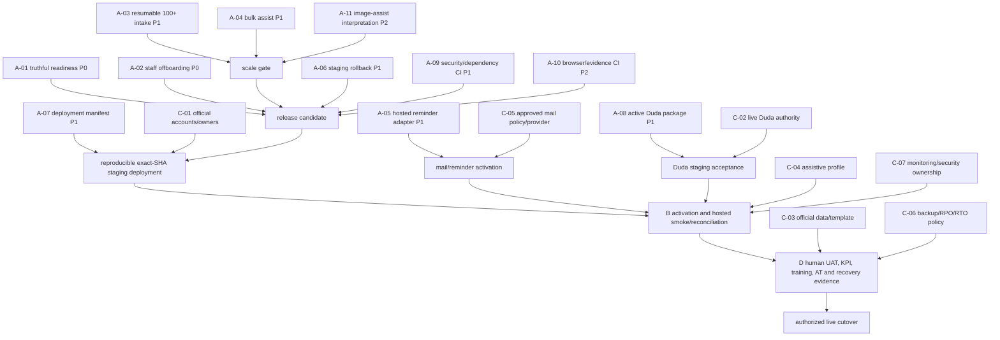

# PP1 Final Machine-Implementation Gap Audit

**Audit date:** 2026-09-09

**Audited revision:** `cea57825b3cc50443db9a5bf544c78844b1781cb`

**Audited branch:** `docs/final-machine-gap-audit`

**Application authority:** `apps/admin-cms` plus its database migrations, executable verification, and the explicitly maintained Duda browser contract

**Output status:** documentation-only independent audit; no application, database, deployment, or external-service change was made

## 1. Executive decision

Current main contains a substantial, test-backed Admin/CMS and controlled publication system. It is not merely a prototype. Persisted browser intake, deterministic validation, Admin Excel reconciliation, project editing, participant confirmation and participant-owned corrections, assistive job execution, approved-only feed compilation, staging publication/removal, audit history, and a 120-project publication exercise all exist in executable code.

It is **not yet genuinely operational and handoff-ready**. The audit found **11 machine implementation gaps**: two P0, seven P1, and two P2. The most consequential are:

1. the deployed readiness endpoint can return `READY` with missing/invalid deployment identity and without proving that the required schema/RPC contract exists;
2. administrators can provision staff but have no supported role-change, deactivation/offboarding, or session-revocation workflow;
3. the browser intake contract rejects more than 25 packages and the review UI operates in selections of at most 50, while assistive checks remain project-by-project;
4. reminder logic exists, but the only executable wrapper is deliberately Local/loopback-only, so hosted reminders have no scheduled execution path;
5. staging publication and removal exist, but rollback is deliberately Local-only;
6. deployment recreation, the maintained Duda renderer boundary, and dependency/security automation are not sufficiently self-contained for an institutional handoff.

These are separate from activation work. Current main is not the revision evidenced as deployed to staging; publication is deliberately deactivated after testing; email and assistive execution fail closed without configuration. Those are activation gaps, not missing code. Live Duda authority, official accounts and credentials, institutional policies, provider choices, and production cutover are institution-dependent. Efficiency, intended-user UAT, training, and native assistive-technology acceptance are human evidence, not machine gaps.

Voting is optional in the requirements basis and there is no evidence that it was selected for this delivery. Its absence is **not a gap**.

## 2. Method and classification

This audit treated executable source, migrations, schemas, tests, and recorded runtime verifiers as higher authority than planning prose. Existing reports were used only to locate executable evidence or to identify deployment/evidence state; they were not accepted as proof that code was absent. In particular, several assertions in `apps/admin-cms/README.md` are stale and were rejected where current source contradicts them.

The following classifications are used throughout:

| Class | Meaning in this audit |
| --- | --- |
| **A — `MACHINE_IMPLEMENTATION_GAP`** | Code, automated tooling, or a maintained machine-readable contract is absent/incomplete. Work can begin in the repository without live credentials or dashboard access. |
| **B — `OPERATIONAL_ACTIVATION_GAP`** | The implementation exists, but the current deployment/profile/gate is not activated or not accepted. |
| **C — `INSTITUTION_DEPENDENT`** | Resolution requires an official owner, account, provider, credential, policy, target, or live-site authority. Repository code cannot supply the decision or authority. |
| **D — `HUMAN_EVIDENCE_ONLY`** | Completion requires measured human performance, intended-user acceptance, training, or supervised accessibility evidence rather than more product code. |
| **E — `STALE_OR_INCOMPLETE_DOCUMENTATION`** | Current documentation or configuration examples misstate implemented behavior or omit material operating configuration. This must be corrected, but is not proof of missing application code. |

Machine-gap priorities are:

- **P0:** can cause a false-safe deployment or leave privileged access ungovernable;
- **P1:** blocks a required operational workflow, scale target, recovery path, or reproducible handoff;
- **P2:** leaves a material quality/coverage weakness but does not by itself block controlled staging use.

No external services or private dashboards were contacted. A focused source-test run was attempted but dependencies are not installed in this worktree (`node_modules/.bin/vitest.cmd` is absent). The PowerShell `npm` shim was also policy-blocked, and `npm.cmd exec` attempted a registry resolution. In accordance with the no-external-services instruction, no install or network retry was performed. The conclusions therefore rely on direct source/test inspection and the request's exact-main-green CI premise, not a newly executed full suite.

## 3. Machine implementation gap register

### A-01 — P0: readiness can be false-green

**Finding.** The public readiness endpoint exposes expected migration information but does not verify that those migrations, required tables, or required RPCs are installed. It can also return HTTP 200 with missing or invalid deployment commit evidence.

**Exact evidence.**

- `apps/admin-cms/src/deployment/deploymentReadinessEndpoint.ts:77` — `hasValidConfiguration()` does not include `deploymentCommit` in the readiness decision.
- `apps/admin-cms/src/deployment/deploymentReadinessEndpoint.ts:109` — `deploymentCommit` is reported, and lines 110–113 report expected migration metadata, but neither is proven against the deployed database.
- `apps/admin-cms/src/deployment/deploymentReadinessEndpoint.ts:117` — `dependencyIsReachable()` performs only a lightweight request to the `programs` REST endpoint; reachability is not schema readiness.
- `apps/admin-cms/src/deployment/deploymentReadinessEndpoint.ts:179-206` — valid basic configuration plus dependency reachability leads to `READY`.
- `apps/admin-cms/src/app/api/readiness/route.test.ts:137` — the test explicitly accepts `deploymentCommit: 'missing'` in a 200 response.
- `apps/admin-cms/src/app/api/readiness/route.test.ts:363` — invalid commit evidence is surfaced rather than made readiness-fatal.
- `apps/admin-cms/src/deployment/hostedDeploymentReadiness.ts` contains stronger table/RPC/bucket checks, proving that a fuller contract is known, but those checks are not wired into `/api/readiness`.

**Operational consequence.** A platform can be routed traffic while running unidentified code or a database missing a later workflow migration. This is a deployment-safety failure, not merely missing documentation.

**Machine closure.** Require valid immutable commit identity in staging/production and add a read-only schema/version capability sentinel that proves the exact required tables, RPCs, and storage contract before returning `READY`. Keep liveness cheap and separate. Add negative route tests for stale schema, absent RPCs, and missing commit identity.

### A-02 — P0: no supported active-staff lifecycle or offboarding

**Finding.** Staff can be invited/provisioned and listed, but the Admin/CMS has no supported administrator workflow to change an active user's roles, deactivate/reactivate an account, offboard a user, or revoke their active sessions.

**Exact evidence.**

- `apps/admin-cms/src/app/api/staff/invitations/route.ts:51` exposes staff invitation creation.
- `apps/admin-cms/src/app/api/staff/test-accounts/route.ts:42` exposes controlled staging test-account creation.
- `apps/admin-cms/src/staff/staffDirectory.ts:43` builds the directory as a read model; `ASSIGNABLE_STAFF_ROLES` at line 115 is used for provisioning, not lifecycle mutation.
- `apps/admin-cms/src/components/admin/StaffDirectoryTable.tsx` renders staff and provisioning state but contains no role/deactivate/revoke action.
- `apps/admin-cms/src/components/admin/StaffDirectoryTable.test.tsx:70` verifies directory display states, not account lifecycle actions.
- Repository route inventory contains no `PATCH`/`DELETE` staff lifecycle route or equivalent active-user lifecycle RPC.

**Operational consequence.** A departing or compromised privileged user cannot be removed using the product operators are being handed. Direct provider/dashboard/database intervention would be required, contrary to operator self-service and auditable governance.

**Machine closure.** Add an admin-only, CSRF-protected, audited lifecycle service/API/UI covering role replacement, deactivation/reactivation, and session revocation. Enforce last-active-admin protection and prevent self-lockout. Provider-side identity disabling must be fail-closed and reconciled with the application profile.

### A-03 — P1: a single browser intake cannot accept a 100+ cohort

**Finding.** Persisted browser import is real, but its batch contract rejects more than 25 packages. The bulk-review contract limits a selection to 50. Existing 120-record evidence demonstrates aggregate workflow/publication capacity, not a single 100+ intake transaction or a resumable cohort import.

**Exact evidence.**

- `apps/admin-cms/src/import/browserImportPreviewContract.ts:14-18` sets `MAX_PACKAGES: 25` and `MAX_METADATA_FILES: 25`.
- `apps/admin-cms/src/import/browserImportPreviewContract.ts:432-436` rejects an over-limit batch.
- `apps/admin-cms/src/import/parseBrowserImportPreview.ts:215-218` enforces the same limit server-side.
- `apps/admin-cms/src/import/__tests__/browserImportPreview.test.ts:375` verifies that 26 packages fail.
- `apps/admin-cms/src/projects/bulkProjectReview.ts:5` bounds a review selection at 50.
- `apps/admin-cms/src/benchmarks/bulkProjectReviewFunctionalWorkflow.ts:225` processes 120 by chunking operations into groups of 50; this is evidence of aggregate processing, not browser intake of 100+.

**Operational consequence.** An operator must manually partition, track, and reconcile at least five imports for a 100-project cohort. That adds collision, omission, repeat, and handoff risk at the central scale requirement.

**Machine closure.** Implement a resumable cohort manifest and bounded chunk orchestration, or safely raise the intake contract after memory/upload testing. Preserve per-package deterministic validation, fingerprints, idempotency, partial-failure recovery, progress, and a final cohort reconciliation summary. Do not replace bounded server operations with one unbounded request.

### A-04 — P1: assistive execution is not operable in bulk

**Finding.** OCR, language, duplicate, formatting, and title-consistency checks run end-to-end for one project, but there is no bulk enqueue/action for a cohort. Bulk review supports only submit, approve, and request-changes.

**Exact evidence.**

- `apps/admin-cms/src/app/admin/projects/[publicId]/assistiveActions.ts:63-103` validates availability and enqueues one project's assistive run.
- `apps/admin-cms/src/components/admin/ProjectAssistiveChecks.tsx:171` invokes that single-project action and polls/cancels/disposes findings.
- `apps/admin-cms/src/assistive-validation/services/assistiveCoordinator.ts:138-153` executes title consistency, formatting, duplicate ranking, OCR-derived checks, and the language provider.
- `apps/admin-cms/src/projects/bulkProjectReview.ts:32` defines the complete bulk action set as `submit_for_review`, `approve`, and `request_changes`; assistive execution is absent.
- `apps/admin-cms/src/assistive-validation/services/assistiveExecutionAvailability.ts:64` correctly fails closed for a hosted profile without verified enablement and worker evidence. That activation boundary is sound but does not provide bulk orchestration.

**Operational consequence.** A 100+ cohort requires 100+ detail-page interactions before reviewers can obtain assistive results. The assistive pipeline exists, but its operational surface does not meet the scale and efficiency intent.

**Machine closure.** Add permissioned bulk preflight and bounded enqueue from the project list/import cohort. Report availability, job-budget impact, already-current jobs, failures, and progress. Reuse existing deduplication/idempotency and keep every finding assistive-only with human disposition authority.

### A-05 — P1: hosted participant reminders have no execution adapter

**Finding.** Reminder scheduling, cancellation, leases, and provider-neutral runner logic exist. The only executable command wrapper deliberately refuses every non-loopback Supabase URL, and no hosted scheduler workflow invokes the runner.

**Exact evidence.**

- `apps/admin-cms/src/reminders/participantPreviewReminderRunner.ts:43` implements the reusable runner.
- `apps/admin-cms/src/scripts/runParticipantPreviewReminders.ts:12-16` labels the command Local/disposable and exposes `runLocalParticipantPreviewReminders()`.
- `apps/admin-cms/src/scripts/runParticipantPreviewReminders.ts:27-29` rejects a non-loopback database.
- `apps/admin-cms/src/scripts/runParticipantPreviewReminders.ts:31-48` resolves fail-closed mail/reminder configuration and invokes the provider-neutral runner only after Local configuration succeeds.
- `apps/admin-cms/package.json:73` exposes the Local reminder script; repository workflow inspection found no scheduled hosted reminder invocation.

**Operational consequence.** Operators can create reminder schedules that no deployed process consumes. Initial emails may work when configured, but automatic follow-up is not operational in hosted staging or production.

**Machine closure.** Add a staging/production-safe scheduled entrypoint with verified runtime identity, least-privilege credentials, lease-safe concurrency, structured outcomes, and a documented health/last-run signal. Activation still depends on institution-approved scheduler and mail configuration (C/B below).

### A-06 — P1: staging publication rollback is deliberately unavailable

**Finding.** Staging publication and archive/removal have controlled writers, immutable versions, reconciliation, and forward recovery. Historical rollback execution is nevertheless restricted to explicit Local/loopback mode.

**Exact evidence.**

- `apps/admin-cms/src/projects/localPublicationExecution.ts:15-21` requires loopback, `CAPSTONE_RUNTIME_ENV=local`, and an explicit Local rollback flag.
- `apps/admin-cms/src/projects/publicFeedHistoryService.ts:215-217` returns `ROLLBACK_UNAVAILABLE` at preparation when that Local predicate fails.
- `apps/admin-cms/src/projects/publicFeedHistoryService.ts:273-275` repeats the guard at execution.
- `apps/admin-cms/src/app/admin/public-feed/page.tsx:93` exposes rollback capability only under the Local predicate.
- `apps/admin-cms/src/app/api/projects/[publicId]/staging-publication/route.ts` and `staging-archive/route.ts` prove that controlled staging publication/removal paths exist; the missing part is staged history rollback.

**Operational consequence.** A bad but successfully activated staging feed can be repaired only by preparing/activating another forward version, not by an operator selecting a known-good immutable version. Live rollback remains correctly unauthorized, but staging needs a tested recovery control before cutover.

**Machine closure.** Extend rollback to verified staging identity with the same exact-head, stale-baseline, singleton-write, acknowledgement, audit, and recovery semantics already used by publication. Add disposable integration coverage. Production enablement remains institution-dependent.

### A-07 — P1: hosted web deployment is not reproducible from a tracked manifest

**Finding.** The repository documents Render deployment but has no tracked Render Blueprint or equivalent machine-readable web-service deployment manifest. An incoming owner must recreate build/start/health/runtime settings manually.

**Exact evidence.**

- `docs/developer-handover-guide.md:91` explicitly states that no Render Blueprint is tracked.
- Repository inventory contains no `render.yaml` or equivalent application deployment descriptor.
- `apps/admin-cms/.env.example` contains only a small subset of the runtime variables documented in `apps/admin-cms/README.md:128-167`; participant mail/reminders, staging publication identity, and hosted assistive settings are absent.

**Operational consequence.** Deployment cannot be deterministically reconstructed or reviewed from source, and configuration drift is likely during ownership transfer.

**Machine closure.** Add a secret-free deployment manifest for the selected current provider and a complete fail-closed environment contract/example. Encode working directory, install/build/start commands, health/readiness paths, immutable commit injection, and non-secret defaults. Account ownership and secret values remain C.

### A-08 — P1: the maintained Duda renderer remains inside the historical Prototype boundary

**Finding.** The Duda consumer is functional and browser-tested, but its operational renderer lives under `Prototype/`, which repository governance otherwise treats as historical. The active application's CI imports that historical path as the authoritative public-layer contract.

**Exact evidence.**

- `Prototype/duda/bodyend.html` is the maintained listing/detail renderer.
- `apps/admin-cms/src/feed/dudaCurrentFeedContract.test.ts:13-20` explicitly loads `../../../../Prototype/duda/bodyend.html` as a plain-browser script.
- `.github/workflows/ci.yml:76-78` runs `npm --prefix Prototype run test:duda-current-feed-browser`.
- `START_HERE.md:17` creates a special exception allowing assigned Duda work in `Prototype/duda/`, while root `AGENTS.md` identifies `Prototype/` as historical evidence to keep isolated and `apps/admin-cms` as the active application.

**Operational consequence.** A maintainer cannot infer a single clean source-of-truth boundary from repository structure, and an archival cleanup could remove a production-relevant renderer/harness.

**Machine closure.** Move the maintained renderer, fixtures, and browser harness into an explicitly active public-layer package/directory and leave `Prototype/` as an immutable historical snapshot. Update Admin/CMS contract tests and CI to target the active artifact. Live Duda installation/publish remains C.

### A-09 — P1: security and dependency change detection is incomplete

**Finding.** CI has strong application and disposable-database checks, but the repository has no automated dependency vulnerability review, maintained dependency update configuration, CodeQL/equivalent SAST, repository secret scan, SBOM/container scan, or immutable pinning for third-party workflow actions.

**Exact evidence.**

- `.github/workflows/ci.yml` runs application, migration, recovery, publication, corrections, and Duda gates but contains no `npm audit`, OSV/Dependabot review, CodeQL, secret-scanning, SBOM, or container-vulnerability job.
- `.github/workflows/*.yml` use moving major action tags such as `actions/checkout@v4` rather than commit-SHA pins.
- Repository inventory contains no `.github/dependabot.yml`.
- `package-lock.json` and pinned Supabase tooling provide reproducibility, but a lockfile does not detect newly disclosed vulnerabilities.

**Operational consequence.** Exact-main functional CI can stay green while known vulnerable dependencies or compromised moving workflow actions remain unnoticed. This is a machine-detectable handoff risk.

**Machine closure.** Add zero-cost dependency and secret/SAST checks appropriate to the repository, establish a reviewed update cadence, pin third-party Actions to immutable SHAs, and generate/retain an SBOM where the deployment artifact permits. Policy for triage ownership is C.

### A-10 — P2: current browser accessibility and release-evidence checks are not continuous gates

**Finding.** Point-in-time browser/accessibility artifacts and a Duda Chrome harness exist, but there is no maintained authenticated Admin/participant end-to-end browser suite in CI. Several evidence verifiers exposed by package scripts are not invoked by repository workflows.

**Exact evidence.**

- `apps/admin-cms/src/scripts/verifyAccessibilityUatEvidence.ts` validates committed evidence integrity; it does not exercise current UI behavior.
- `docs/ACCESSIBILITY_UAT_CHECKLIST.md:3` remains `PARTIAL`; native screen-reader checks at lines 67–68 are incomplete.
- `apps/admin-cms/package.json:18`, `:72`, and `:96` expose release-evaluation, annual-publication-evidence, and accessibility-evidence verification commands.
- Workflow search found none of those three commands in `.github/workflows/`.
- `.github/workflows/ci.yml:76-78` does execute the Duda Chrome harness, so public-renderer browser behavior is covered; the gap is authenticated Admin and participant journeys plus evidence freshness.

**Operational consequence.** UI regressions in keyboard flow, focus, responsive behavior, authentication, import, review, or participant correction can pass source-level CI. Committed evidence can remain internally valid while no longer matching current code.

**Machine closure.** Add a small deterministic browser suite for critical Admin and participant journeys with automated accessibility assertions. Run the inexpensive integrity verifiers at appropriate PR/release gates and the heavier 100+ exercise at a deliberate release/scheduled gate. Native assistive-technology acceptance remains D.

### A-11 — P2: assistive image analysis stops at technical/OCR checks

**Finding.** Media bytes, type/dimensions, required files, alt text, and OCR-derived title/format signals are validated. The assistive coordinator does not produce findings for broader image-quality, image duplication, legibility/contrast, or image-to-project consistency.

**Exact evidence.**

- `apps/admin-cms/src/storage/mediaValidationCore.ts:109` performs technical media byte validation.
- `apps/admin-cms/src/assistive-validation/services/assistiveCoordinator.ts:138-153` enumerates title consistency, formatting, duplicate ranking, and language execution; it contains no general visual-image analysis stage.
- `apps/admin-cms/src/components/admin/ProjectAssistiveChecks.tsx` presents the findings returned by that coordinator and therefore cannot surface a missing image-analysis category.
- Public and participant contracts require full text/alt text, so accessible publication is not dependent on automated image interpretation.

**Operational consequence.** If the original “image” assistive requirement is interpreted beyond file safety/format/OCR-title validation, reviewers receive no machine assistance for repeated, illegible, or contextually inconsistent imagery. This is lower priority because human review remains authoritative and the zero-paid-services constraint limits provider choices.

**Machine closure.** Define a bounded, locally testable image-assist contract and add advisory findings with confidence/provenance and human disposition. Never auto-reject or auto-publish. If the institution formally narrows “image” to the existing technical/OCR controls, record that interpretation and close this item without new code.

## 4. Required-domain audit matrix

| # | Domain | Implemented evidence | Remaining classification |
| --- | --- | --- | --- |
| 1 | Import/intake/bulk 100+ | Persisted metadata/media staging in `BrowserImportPreviewClient.tsx`, `stageBrowserImportMetadata.ts`, `stageBrowserImportMedia.ts`; 120-record functional/publication exercises | **A-03**, **A-04**. Aggregate 120 capability exists; single-cohort intake and bulk assist do not. |
| 2 | Validation and Admin Excel reconciliation | `adminReferenceReconciliationCore.ts`, `AdminReferenceDatasetSection.tsx`, `verifyAdminExcelReconciliationRuntime.ts`, and reconciliation tests enforce fingerprint/mapping/package checks | **C:** official workbook/template/mapping ownership and acceptance. No current machine gap found. |
| 3 | OCR/language/duplicate button-to-worker-to-results | `assistiveActions.ts` → persistent jobs/worker → `assistiveCoordinator.ts` → `ProjectAssistiveChecks.tsx`; availability/heartbeat fails closed | **A-04**, **A-11**; **B/C:** activate an approved compute/provider profile. |
| 4 | Review/edit/participant corrections | Atomic metadata RPC/editor; review transitions; tokenized participant confirm/request-change; complete participant-owned XLSX/media package reservation, upload, staff accept/return in `participantCorrectionService.ts`, `participantCorrectionReview.ts`, and migration `20260903130000_participant_owned_corrections.sql` | **D:** intended-user acceptance. No current machine gap found. |
| 5 | Preview/email/reminders | Server-derived participant recipient; tokenized preview; SMTP lifecycle; schedule/cancel and lease-safe reminder runner | **A-05**; **B/C:** enable accepted mail/scheduler configuration and sender policy. |
| 6 | Approval/publication/archive/removal/reconciliation/rollback | Approval/confirmed-preview/readiness gates; exact-byte feed versions; staging publication/archive; ledger; head reconciliation; forward recovery | **A-06**; **C:** live publication and rollback authority. |
| 7 | Duda feed/renderer and cutover | Approved/published-only compiler; stable current feed; safe listing/detail renderer; search/facets; alt/full text; browser harness; 120-record exercise | **A-08**; **C:** official Duda site installation, final live URL/CSP and publish authority. |
| 8 | Auth/staff lifecycle | Supabase session resolution, RBAC, CSRF, RLS, invitations, activation, test-account control, recovery, directory | **A-02**; **C:** official identity owners/MFA/rotation policy; **D:** staff acceptance. |
| 9 | Accessibility content/browser evidence | Required poster/accessibility text and alt content propagate to feed/Duda; keyboard/mobile/zoom/Lighthouse evidence and Duda browser harness exist | **A-10**; **D:** native NVDA/VoiceOver/TalkBack and intended-user acceptance. |
| 10 | Monitoring/incident handling | `/api/health`, `/api/readiness`, 6-hour workflow in `zero-cost-staging-monitoring.yml`, incident/reconciliation runbooks | **A-01**; **B:** confirm scheduled workflow operation; **C:** alert recipient, acknowledgement/escalation ownership, and external monitor choice. |
| 11 | Backup/recovery/RPO/RTO | Migration reconstruction and disposable PG17 restore verification cover database/auth/custom schema and all four buckets; measurement calculator/runbook exists | **C:** official backup mechanism, cadence, retention, encryption, restore target, and targets; **D:** timed supervised recovery proves achieved RPO/RTO. No current product-code gap proven. |
| 12 | Deployment/staging identity/configuration | Verified runtime identity guards, migration/runtime checks, health/readiness routes, handover commands | **A-01**, **A-07**; **B:** deploy exact current SHA; **C:** official hosting/database ownership, credentials, domains, and production identity. |
| 13 | Handoff/operator self-service/current docs | Operator guide and UI cover normal import/review/correction/publication operations; developer setup/recovery guides are extensive | **A-02**, **A-05**, **A-07**, **A-08**; **C/D:** named owners, training, sign-off; **E:** stale README/config examples below. |
| 14 | Security/dependency/CI | RBAC/RLS/CSRF, server-only secret boundaries, migration/RPC/disposable runtime gates, unit/type/lint/build CI | **A-09**, **A-10**; **C:** vulnerability-triage owner and response SLA. |

## 5. Non-machine gap registers

### B — Operational activation gaps

| ID | Current state | Evidence and required activation |
| --- | --- | --- |
| B-01 | Exact current main is not the revision evidenced as deployed | `docs/m6-operational-readiness.md:44-45` records staging at `50d02632…`, not audited `cea57825…`. Deploy exact current revision, then repeat identity/readiness/smoke evidence. This audit did not contact staging. |
| B-02 | Controlled publication is intentionally inactive after evidence capture | Current operational reports record the publication gate restored false and the feed restored empty after the controlled exercise. An authorized operator must deliberately reopen the staging gate; this is not absent code. |
| B-03 | Email/reminders and hosted assistive execution fail closed without accepted configuration/worker evidence | `participantPreviewEmailConfig.ts`, `participantPreviewReminderConfig.ts`, and `assistiveExecutionAvailability.ts` require explicit enablement and valid configuration/heartbeat. Configure only after C-level provider/owner decisions. A-05 must first provide the hosted reminder executor. |
| B-04 | Repository monitoring exists but operational alert handling is not accepted | `.github/workflows/zero-cost-staging-monitoring.yml:5-6` schedules a six-hour check. Confirm it is enabled on the default branch and connect its failures to the C-level incident owner/escalation route. |

### C — Institution-dependent prerequisites

| ID | Required institutional input/authority |
| --- | --- |
| C-01 | Official Supabase, hosting, Duda, email, and any assistive-compute accounts; least-privilege credentials; named owners; MFA/rotation/offboarding policy. |
| C-02 | Production domains, Duda live-site edit/publish authority, approved feed origin/CSP, cutover window, and explicit live publication/rollback authority. Agents are not authorized to make these changes. |
| C-03 | Official intake workbook/template, column mapping, program taxonomy, participant-contact rules, privacy/retention rules, and real-data owner approval. |
| C-04 | Approved zero-paid assistive execution profile, compute ownership/capacity, provider licensing/privacy decision, budget policy, and operator responsibility. |
| C-05 | Email sender/domain, SMTP/provider, consent/legal basis, reminder cadence/content, bounce/escalation policy, and operational mailbox owner. |
| C-06 | Backup platform/export authority, cadence, retention, encryption/key custody, geographically/administratively suitable restore target, and target RPO/RTO. |
| C-07 | Monitoring destination, on-call/working-hours model, severity policy, acknowledgement/escalation route, and vulnerability-triage owner/SLA. |

### D — Human evidence only

| ID | Evidence still required |
| --- | --- |
| D-01 | Same-batch, measured baseline-versus-platform operator timings demonstrating at least 50% human-effort reduction. The 120-record machine exercise proves technical capacity, not labor savings. |
| D-02 | Intended-user UAT for intake, reconciliation, review, participant correction, publication, archive/removal, and incident/recovery workflows, with signed acceptance and unresolved-issue disposition. |
| D-03 | Operator/admin training and unaided task completion against an institution-approved threshold, plus named handover acceptance. |
| D-04 | Native assistive-technology testing (at minimum the agreed NVDA/VoiceOver/TalkBack matrix) and disabled-user or accessibility-owner acceptance. Automated Lighthouse/DOM checks cannot substitute for it. |
| D-05 | Supervised timed backup/restore exercise in an authorized representative environment to establish achieved RPO/RTO against the targets selected under C-06. |
| D-06 | Authorized 100+ real-cohort acceptance from intake through live presentation. Existing synthetic/disposable 120-record evidence remains valid machine evidence but is not institutional acceptance. |

### E — Stale or incomplete current documentation

These documentation defects must not be reclassified as application gaps:

| Evidence | Stale/incomplete assertion | Current source reality |
| --- | --- | --- |
| `apps/admin-cms/README.md:17,439` | Integrated participant preview workspace remains unavailable/pending | Participant confirmation, request-change, owned correction package upload, staff review, and atomic acceptance are implemented and runtime-tested. |
| `apps/admin-cms/README.md:50,222,224-225,438` | 35 migrations and newer migrations are repository/local-only or migration 0009 is not hosted | Current repository has 52 migrations and current operational/runtime evidence describes later hosted/disposable upgrade verification. Documentation must distinguish recorded hosted revision from current migration count accurately. |
| `apps/admin-cms/README.md:354` | “No OCR and no AI” | Accessible full text/alt remain human-authored, but the product does execute assistive OCR/language/duplicate/format/title checks. The sentence must be narrowed to content authorship. |
| `apps/admin-cms/README.md:358` | Broader gallery capability is future work | Current schemas, editor/participant flows, storage/publication bindings, and Duda renderer support multi-image galleries. |
| `apps/admin-cms/README.md:390,393` | Browser import is non-persisting/future | Current routes/services persist metadata and media and submit staged records for review. |
| `apps/admin-cms/README.md:419` | Hosted CI evidence is not asserted | Exact-main CI is supplied as green for this audit and current workflow contains extensive disposable/hosted-boundary verification. Claims should identify evidence date/revision rather than remain absolute. |
| `apps/admin-cms/.env.example` | Only baseline Supabase/runtime/storage/Gemini variables are represented | README/source require additional mail, reminder, publication, staging identity, and assistive worker configuration. Add names and safe disabled examples only—never values. |
| `START_HERE.md:17` versus root `AGENTS.md` | Duda is an operational exception inside a historical directory | This accurately describes today's exception but is structurally fragile; A-08 should remove the contradiction. |

## 6. Confirmed complete capabilities and rejected false positives

The following were inspected and must **not** be reported as missing merely because older prose calls them future work:

- **Persisted browser intake:** `BrowserImportPreviewClient.tsx` calls the metadata/media staging and submit-for-review routes; `stageBrowserImportMetadata.ts` and `stageBrowserImportMedia.ts` persist the batch.
- **Deterministic validation and Admin Excel cross-check:** workbook fingerprints, declared mapping, row parsing, package matching, and revalidation exist in `adminReferenceReconciliationCore.ts` and its runtime/test coverage.
- **Assistive execution, not just schemas:** project button/action, availability preflight, durable job, worker/heartbeat, OCR/language/duplicate/format/title checks, polling/cancellation, findings, and human dispositions are wired end to end. Hosted activation is separate.
- **Participant-controlled correction:** the participant can confirm, request changes, or upload a bounded complete XLSX/media package; staff can begin review, accept atomically, or return it. This is more than a token preview page.
- **Initial participant email:** server-derived recipient, token lifecycle, SMTP transport, retry-safe state, and audit behavior exist. The missing scheduled hosted reminder adapter is narrower.
- **Approved-only automated feed:** feed compilation excludes unapproved records; activation is versioned, exact-byte/hash checked, serialized, auditable, reconcilable, and recoverable.
- **Archive/unpublish/removal:** controlled staging archive/removal and reconciliation exist. The gap is historical rollback outside Local, not removal itself.
- **Duda listing/detail behavior:** the renderer supports safe search/facets, listing/detail, full text/alt, media, and current-feed consumption with a Chrome contract harness.
- **100+ machine processing/publication:** a 120-record workflow/publication evidence path exists. It does not satisfy single-batch intake, bulk assist, human efficiency, or live institutional acceptance.
- **Accessibility content contract:** full poster/accessibility text and meaningful alt are required and propagated to public output. Automated image description is neither required nor allowed to replace human authority.
- **Audit/governance:** workflow, participant correction, assistive disposition, publication version/head, and activation/recovery operations have persisted audit/ledger foundations.
- **Recovery tooling:** disposable restoration covers database migrations/state, Auth/custom schema, and storage inventory; the missing decisions and achieved RPO/RTO are C/D.
- **Voting:** not selected; optional scope means absence is not a defect.

## 7. Dependency graph and parallel closure plan

Recommended closure order:

1. **Immediately and in parallel:** A-01, A-02, A-03, A-04, A-05, A-06, A-07, A-08, and A-09. None requires live dashboard access to begin; provider-facing activation must remain mocked/fail-closed.
2. **Quality lane:** resolve the A-11 requirement interpretation, implement A-10, and correct E documentation/config examples alongside the owning code changes.
3. **Institution lane:** appoint owners and settle C-01 through C-07 while machine work proceeds. Do not embed credentials or policy guesses in repository code.
4. **Release gate:** deploy the exact candidate using A-07, require A-01 to prove exact identity/schema, activate only accepted profiles, then repeat hosted smoke, publication/reconciliation, monitoring, and recovery checks.
5. **Acceptance gate:** collect D-01 through D-06 on the same accepted candidate. Only authorized institutional owners can approve live Duda/publication cutover.

## 8. Final audit conclusion

The platform has crossed the threshold from feasibility code to a substantial controlled staging implementation. Its remaining risk is concentrated rather than systemic: truthful readiness, privileged-user lifecycle, cohort-scale operator surfaces, hosted reminder execution, staged rollback, reproducible deployment/public-layer ownership, and continuous security/browser assurance.

Closing the 11 A-items would make the repository technically handoff-capable; it would **not** by itself make the system live. B activation, C institutional authority/configuration, and D human evidence must be completed and signed against the same immutable release revision. Any report that converts those external prerequisites into “missing code,” or that uses the stale Admin/CMS README to deny already implemented workflows, would misstate current main.
