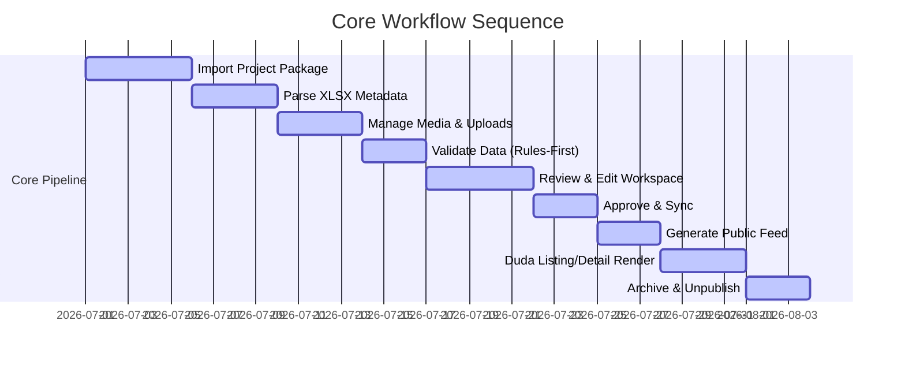

# Part 2 Backlog

This backlog outlines the tasks required to transition the feasibility prototype (v2) into a robust, secure, and production-ready Capstone Impact Platform. Tasks are organized by priority using MoSCoW methodology.

---

## 1. Must Have (Core Publishing Workflow)
These tasks form the essential backbone of the publishing pipeline. They must be implemented to achieve a minimal viable production deployment.

### [1.0] Planning & Design Alignment
- [ ] **Confirm Schema & Feed Contract**: Enforce alignment sessions in early July to review and lock the production database schema and approved-only public feed contracts with coordinators, academic advisors, and developers prior to any code implementation.

### [1.1] Ingestion & Inbound Parsing
- [ ] **Import Project Package**: Implement secure folder-import and ZIP-file upload handlers supporting single-project directories.
- [ ] **Parse XLSX Metadata**: Build a robust parser for `project-details.xlsx` that extracts core project fields, team rosters, supervisors, disciplines, and citations.
- [ ] **Path Safety Enforcement**: Sanitize all imported folder structures, resolving relative path sequences and enforcing naming rules to prevent directory traversal.

### [1.2] Media Storage & Validation
- [ ] **Media Handling and Public/Private Asset Separation**: Establish a secure upload service to copy posters and snapshots directly to Supabase storage with clear path segregation.
- [ ] **Rules-First Validation Engine**: Run synchronous backend checks:
    - Verify file types (JPG/PNG/PDF only).
    - Validate dimensions and file size ceilings (e.g., posters under 5MB).
    - Ensure presence of required snapshots and metadata fields.
- [ ] **Error & Warning Logger**: Write a structured log of errors (blocking approval) and warnings (non-blocking) into the database record.

### [1.3] Review & Workspaces
- [ ] **Admin Dashboard Redesign**: Refactor `src/App.jsx` into modular React components (Dashboard, ProjectList, EditorForm, UploadPanel).
- [ ] **Metadata Editor Form**: Create tabbed edit interfaces with real-time field validation matches.
- [ ] **Student Review/Preview Panel**: Generate temporary, token-authenticated preview URLs that students can view to check their layout before approval.
- [ ] **Manual Approval Loop**: Enable transitioning records to "Approved" once all validation errors are resolved.

### [1.4] Publishing & Presenting
- [ ] **Public Feed Generation**: Establish a secure Express endpoint that queries "Approved" and "Published" records, strips internal columns, and generates a schema-compliant public JSON file.
- [ ] **Supabase CDN Stable Sync**: Automate overwrite of the public bucket JSON feed when an administrator executes a "Publish" action.
- [ ] **Duda bodyend.html Refactoring**: Refactor, modularize, and optimize the Duda Footer Script to execute asynchronously and handle errors gracefully.
- [ ] **Safe Archive & Unpublish**: Implement standard soft-deletion and archival status flows that immediately remove projects from the public JSON feed.

---

## 2. Should Have (Security & Operational Resilience)
These tasks provide critical hardening, error prevention, and operational safety, but are secondary to the raw publishing pipeline.

### [2.1] Identity & Access Management
- [ ] **Admin Authentication**: Implement secure JWT/cookie-based login for administrative users using Supabase Auth.
- [ ] **Row-Level Security (RLS)**: Enforce RLS policies on Supabase tables to block public access to internal drafts, audit logs, and backups.

### [2.2] State Persistence & Operations
- [ ] **Staging State Auto-Backup**: Integrate automated staging state backups (`adminStateBackup.js`) to back up database writes to a private storage bucket on backend restarts (assuming a free-tier hosting option to be verified later).
- [ ] **Import Queue**: Run batch file processes asynchronously so the main event loop is never blocked by massive uploads.
- [ ] **Conflict Edit Prevention**: Implement record-locking or edit-conflict detection to prevent multiple administrators from overwriting changes.

---

## 3. Could Have (Assistive Automation)
These features represent non-blocking enhancements that automate manual steps or improve user convenience.

### [3.1] Assistive AI & OCR
- [ ] **PDF Text Extraction**: Implement client-side or server-side OCR on poster PDFs to extract text snippets.
- [ ] **Assistive AI Auto-Fill**: Create an optional AI matching engine that suggests metadata values (e.g., title, group name, study programs) from extracted text.
- [ ] **Discipline Categorization Helper**: Let AI suggest project disciplines based on the background and solution fields.

### [3.2] Advanced Previews
- [ ] **Live Drag-and-Drop Layout Editor**: Provide interactive sliders to change image alignment or grid styles inside the CMS before publishing.
- [ ] **In-App Messaging Feed**: Build a simple communication log where student feedback on preview rejects is displayed directly inside the review workspace.

---

## 4. Out of Scope for Now (Future Phases)
These items are deferred to future project iterations beyond the current capstone deliverables.

- [x] **Duda Platform Upgrade**: Native collection syncing and premium Duda databases are permanently out of scope.
- [x] **Monolithic WordPress CMS**: Replacing the entire architecture with WordPress.
- [x] **Global Public Social Engagement**: Public upvoting, project likes, comments sections, or student social networks.
- [x] **Automated CRM/Email Integration**: Setting up third-party mail exchanges (like Mailgun/Sendgrid) for student correspondence prior to university email proxy clearances.
- [x] **Duda Visual / Design Changes**: **No Duda-facing changes should be made during the break; current Duda prototype evidence must be preserved and reconfirmed in July.**
