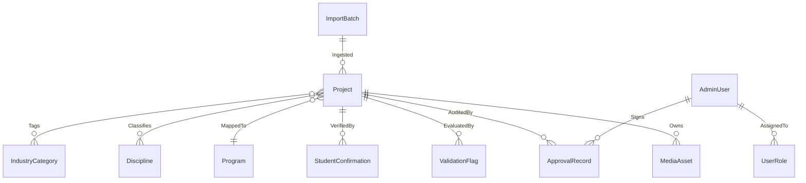
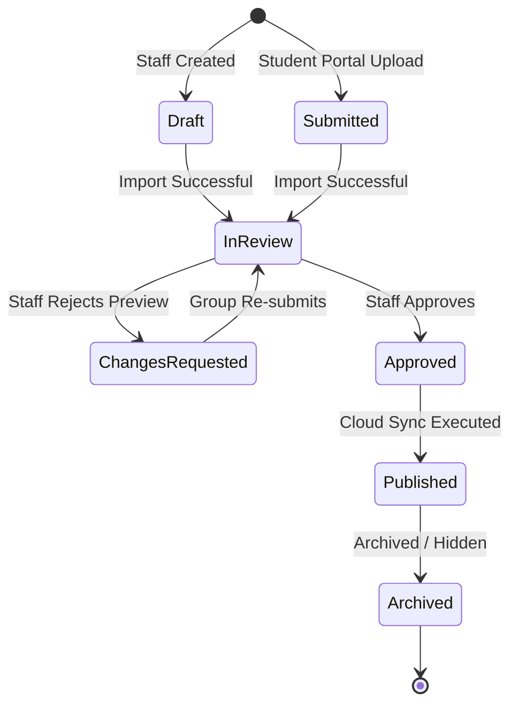

# Draft Production Schema Layout (Part 2)

This document presents a proposed production-grade database schema layout for the Capstone Impact Platform. It is designed to replace the single-table JSONB storage model utilized in Prototype v2 with a structured, relational model backing the School-owned Admin/CMS.

> [!WARNING]
> **Planning Draft Only**
> This schema is a planning draft designed for architectural discussion. It is *not* a finalized schema and must not be implemented or locked in before the formal stakeholder and academic advisor confirmation sessions in July 2026. Do not write SQL migrations or build Supabase tables based on this draft during the break.

---

## 1. Design Goals
*   **Decoupled Source of Truth**: Establish the School-owned database as the absolute operational source of truth.
*   **Relational Integrity**: Deconstruct the flexible JSON blob from Prototype v2 into structured relational tables (e.g. tracking programs, disciplines, media assets) to enforce schema compliance.
*   **Access Auditing & Logging**: Enforce strict tracking of data changes, draft reviews, and publisher action events.
*   **Least Privilege Access (RLS/RBAC)**: Support robust Row-Level Security policies to protect private student submission data from public queries.

---

## 2. Core Entities Overview

The proposed production data model comprises the following core entities:

| Entity Name | Description | Status / Part 2 Context |
| :--- | :--- | :--- |
| **`Project`** | Represents a capstone project submission, tracking metadata, semester, year, and workflow state. | Core |
| **`MediaAsset`** | Tracks metadata and secure URLs for files (e.g., posters, snapshot sliders, videos, 3D models). | Core |
| **`ImportBatch`** | Logs batch ingestion events, tracking when XLSX packages are uploaded and which files belong to a run. | Core |
| **`ValidationFlag`** | Tracks synchronous rules-based validation outputs (blocking errors and warnings). | Core |
| **`ApprovalRecord`** | Stores administrative status transitions, review comments, and approval signatures. | Core |
| **`PublishedSnapshot`** | Stores immutable snapshots of compiled feeds and historic states. | Core |
| **`AdminUser`** | Stores school staff users authorized to access the Admin/CMS. | Core |
| **`UserRole`** | Defines permissions and access control limits (e.g., `coordinator`, `reviewer`). | Core |
| **`Program`** | Standardized academic programs (e.g., Bachelor of Software Engineering). | Core |
| **`Discipline`** | Standardized technical disciplines (e.g., IT, Food Tech, Mechanical Engineering). | Core |
| **`IndustryCategory`** | Tags mapped to industry partners or target areas (e.g., Agriculture, Sustainability). | Core |
| **`StudentConfirmation`** | Tracks student-group preview sign-offs, feedback, and token-access logs. | Draft / Future Phase |

---

## 3. Entity Relationship Overview

The relationships between entities are defined relational dependencies, ensuring that data points do not reside in loose JSON blobs.

---

## 4. Suggested Fields and Relational Segregation

### A. Project Entity
*   `id`: `bigint` (Deterministic ID generated based on `year` and `slug`)
*   `title`: `varchar(255)` (Required public title)
*   `slug`: `varchar(255)` (URL-friendly string)
*   `summary`: `text` (Brief public summary)
*   `background`: `text` (Public background description)
*   `solution`: `text` (Public solution description)
*   `year`: `integer` (Public calendar year)
*   `program_id`: `foreign_key` referencing `Program`
*   `group_name`: `varchar(255)` (Student group identifier)
*   `team_members`: `text[]` (Array of student names)
*   `industry_partner`: `varchar(255)`
*   `academic_supervisor`: `varchar(255)`
*   `layout_template_id`: `varchar(50)` (Default: `poster_showcase`)
*   `layout_featured_media`: `varchar(50)` (Default: `poster`)
*   `status`: `varchar(50)` (Workflow status: `draft`, `submitted`, `in_review`, `approved`, `published`, `archived`)
*   `import_batch_id`: `foreign_key` referencing `ImportBatch` (Nullable)
*   `internal_staff_notes`: `text` (Private)
*   `private_review_comments`: `text` (Private)
*   `accessibility_text_public`: `text` (Reviewed public accessibility description)
*   `poster_text_public`: `text` (Reviewed public poster text content)
*   `created_at`: `timestamp`
*   `updated_at`: `timestamp`

### B. MediaAsset Entity
*   `id`: `uuid` (Primary Key)
*   `project_id`: `foreign_key` referencing `Project`
*   `asset_type`: `varchar(50)` (e.g. `poster_image`, `poster_pdf`, `snapshot`, `demo_video`, `3d_model`, `accessibility_text`)
*   `file_name`: `varchar(255)` (Sanitized name)
*   `storage_bucket`: `varchar(100)` (Indicates private vs. public storage path)
*   `storage_path`: `text` (Full path in cloud bucket)
*   `public_url`: `text` (Nullable; active only when approved for the public showcase)
*   `file_size`: `integer` (In bytes)
*   `created_at`: `timestamp`

### C. ImportBatch Entity
*   `id`: `varchar(100)` (Format: `import-YYYYMMDD-HHMMSS`)
*   `imported_by`: `foreign_key` referencing `AdminUser`
*   `mode`: `varchar(50)` (e.g. `single`, `batch`)
*   `source_folder`: `varchar(255)` (Original uploaded path reference)
*   `created_at`: `timestamp`

### D. ValidationFlag Entity
*   `id`: `bigint` (Primary Key)
*   `project_id`: `foreign_key` referencing `Project`
*   `severity`: `varchar(50)` (e.g., `error`, `warning`)
*   `rule_code`: `varchar(100)` (e.g. `MISSING_ACCESSIBILITY`, `OVERSIZED_POSTER`)
*   `message`: `text` (Human-readable description)
*   `resolved`: `boolean` (Default: `false`)
*   `resolved_by`: `foreign_key` referencing `AdminUser` (Nullable)
*   `created_at`: `timestamp`

### E. ApprovalRecord Entity
*   `id`: `bigint` (Primary Key)
*   `project_id`: `foreign_key` referencing `Project`
*   `admin_id`: `foreign_key` referencing `AdminUser`
*   `action_taken`: `varchar(50)` (e.g. `request_changes`, `approve`, `publish`, `archive`)
*   `comments`: `text` (Review details for logging)
*   `created_at`: `timestamp`

---

## 5. Internal-Only Fields vs. Public-Safe Fields

To ensure absolute privacy compliance, fields must be strictly categorized into internal-only (restricted to the CMS database) and public-safe (published to the public feed).

| Internal-Only Fields (Restricted to Admin/CMS) | Public-Safe Fields (Safe for Showcase Feed) |
| :--- | :--- |
| `status` (internal workflow status) | `id` (Deterministic identifier) |
| `import_batch_id` | `title` (Project title) |
| `source_folder` (raw folder naming) | `summary` (Short description) |
| `internal_staff_notes` (private notes) | `background` (Project context) |
| `private_review_comments` (review notes) | `solution` (Project solution) |
| `validation_flags` (error/warning outputs) | `year` (Calendar year) |
| `pending_removal_from_public` (status flags) | `group_name` (Team group) |
| `admin_id` (record author identity) | `team_members` (Student names array) |
| `archive_reason` | `academic_supervisor` |
| Raw OCR/extraction logs and private processing notes | `industry_partner` |
| Raw/private extraction fields | `accessibilityText` (Reviewed public accessibility text) |
| Raw path files (e.g. `imports/batch-1/raw-poster.png`) | `posterText` (Reviewed public poster text) |
| System timestamps (`deleted_at`, etc.) | `snapshots` (Public URLs only) |
| - | `layoutConfig` (Visual presets only) |

---

## 6. Workflow Status Model

Projects progress through a linear state machine in the operational Admin/CMS:

*   **Draft / Submitted**: Inactive intermediate states.
*   **In Review**: Inbound package has passed rules-first validation; staff checks fields.
*   **Approved**: Metadata is locked and validated; ready to enter the next batch compilation.
*   **Published**: Record is compiled into the public JSON feed and is active in the showcase.
*   **Archived**: Hidden from the public feed but preserved permanently in the internal database for administrative reference and assessment evidence.

---

## 7. Deletion and Archive Policy
*   **Soft Deletion Only**: Physical database records should never be deleted by standard admin panels. Accidental hard deletions result in permanent loss of metadata. Instead, standard delete triggers mark records with a `deleted_at` timestamp.
*   **Trash Recovery Flow**: A logical trash bin lets administrators view soft-deleted projects and restore them if needed.
*   **Archive vs. Delete**: Archive workflows change the project `status` to `archived` and set `pending_removal_from_public: true`. On the next cloud sync, the project is safely stripped from the public feed, but the internal DB record and uploaded files remain intact inside private buckets for historic compliance.

---

## 8. Row-Level Security (RLS) & Access Control
*   **Supabase RLS Policies**: Enforce strict RLS policies on all tables. 
    *   Unauthenticated public requests: Allowed to read compiled snapshots only (`GET` public feed path). Direct access to `Project` or `MediaAsset` tables is strictly blocked (`RESTRICT`).
    *   Authenticated school staff: Permitted full CRUD operations on `Project` and dependencies based on verified administrator JWT cookies.
*   **Role-Based Access Control (RBAC)**:
    *   `coordinator`: Full operational capabilities including importing packages, modifying metadata, approving projects, publishing to the Duda cloud feed, and deleting/archiving records.
    *   `reviewer`: Restricted capabilities including viewing projects, running validation checks, and adding review notes. Unauthorised to approve, publish, or delete records.

---

## 9. Open Questions for Stakeholder Confirmation (July)
*   *Database Selection*: Will the school host the Express CMS database on a dedicated local server or utilize a managed Supabase free-tier database layout?
*   *Historic Retention*: What is the official compliance retention period for archived project metadata? Can files be deleted from storage after a set number of years to preserve free-tier storage caps?
*   *Student Portal Authentication*: Will student groups authenticate using RMIT OAuth systems to submit files, or will the system utilize temporary token-based email links for simple confirmation?
