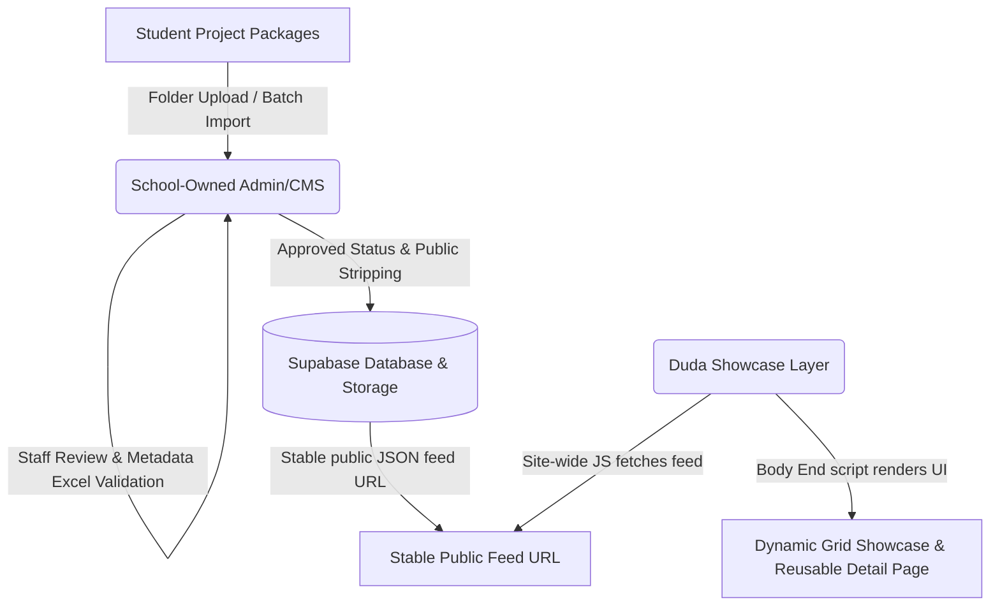

# Working Document: Current Project State

## 1. Project Status Summary
As of June 2026, the PP1 Capstone Project (**Capstone Impact Platform**) has successfully concluded its initial prototyping phase. The team (**RuntimeError**) has developed and validated **Prototype v2**, which implements the core hybrid architecture required to bridge the Capstone project data management and the public-facing showcase.

This document serves as the operational baseline and transition plan for the upcoming Part 2 phase. During this interim academic break, the project undergoes documentation consolidation, thorough audits, and safe preparatory cleanup. No production deployments, stakeholder-facing changes, or irreversible modifications are to be executed.

## 2. Feasibility of Prototype v2
Prototype v2 is **feasibility evidence only, not the final production baseline**. It is designed to prove that the core technological and structural assumptions of the Capstone Impact Platform are viable. 

### What Prototype v2 Has Proven
*   **Decoupled Syncing**: A Node/Express and React/Vite admin system can successfully orchestrate and validate Capstone project metadata and assets, writing them to a central database.
*   **Dynamic Client-Side Duda Integration**: An external JavaScript payload (`bodyend.html`) can intercept Duda's lifecycle, fetch a stable public JSON feed from public storage (Supabase), and dynamically render complex layout presets (posters, snapshot carousels, team details, and supervisor information) on Duda listing and custom detail pages.
*   **Validation Pipeline**: Validating uploaded project directories (XLSX parsing, media assets checks, file types, and size constraints) is achievable in real-time.
*   **JSON-in-Database Model**: Storing unstructured or highly flexible Capstone project schema inside a single JSON-column field in a Supabase table allows rapid adjustments to schema variations across different semesters without requiring complex relational schema migrations.

> [!IMPORTANT]
> **Prototype v2 is NOT the final production baseline.** The code, local state mechanisms (such as `data/db.json` mirrored to Supabase), and unsecured prototype endpoints serve as architectural validation. Part 2 will transition these proof-of-concepts into a production-grade, secure, and resilient system.

## 3. Selected Architecture: No-Upgrade Hybrid Direction
Due to hard constraints regarding platform access, budget, and administrative policies, the team has selected the **No-Upgrade Hybrid Architecture**. 

This architecture consists of three distinct layers:
1.  **Duda Public Showcase Layer**: Retained strictly as a public-facing, responsive presentation shell. To work around the constraint of no Duda tier upgrades, Duda does *not* host collections or dynamic pages natively. Instead, it embeds a custom JavaScript payload (`bodyend.html`) in its footer.
2.  **School-Owned Admin/CMS (Source of Truth)**: A standalone, custom web application managed by RMIT/School staff. It is the absolute operational source of truth. It handles all administrative workflows: importing student packages, parsing Excel metadata templates (`project-details.xlsx`), handling media validation, resolving metadata warnings, orchestrating review loops with student groups, managing approval statuses, and executing safe data archival or deletion.
3.  **Approved-Only Public Feed**: The Admin/CMS filters database records, strips away all internal metadata, private staff notes, and workflow logs, and generates a clean, schema-validated JSON feed. This feed is published to a stable, persistent URL (e.g., in a public Supabase Storage bucket or static file service) that Duda queries at runtime.

## 4. Break Work Scope
During the current break, all tasks are restricted to safe, non-destructive, and planning-focused operations:
*   **Planning & Architecture**: Documenting system boundaries, hard constraints, and schema expectations. All break work must be completely reversible and assume a free-tier hosting option to be verified later.
*   **Code Auditing**: Detailed inspection of Prototype v2 codebase to discover security gaps, technical debt, and areas requiring a redesign for production. A comprehensive, read-only [security-and-maintainability-map.md](file:///d:/IT%20RMIT/Capstone/docs/security-and-maintainability-map.md) has been created to guide Part 2 planning. This mapping is strictly for planning purposes, and no active code changes or deployment modifications have been made.
*   **Safe Foundation Work**: Restructuring documentation, cleaning up duplicate notes, and organizing a highly structured Part 2 backlog.
*   **No Active Changes**: No changes to live database configurations, environment variables, or deployed services will be made during this time. **No Duda-facing changes should be made during the break; current Duda prototype evidence must be preserved and reconfirmed in July.**
