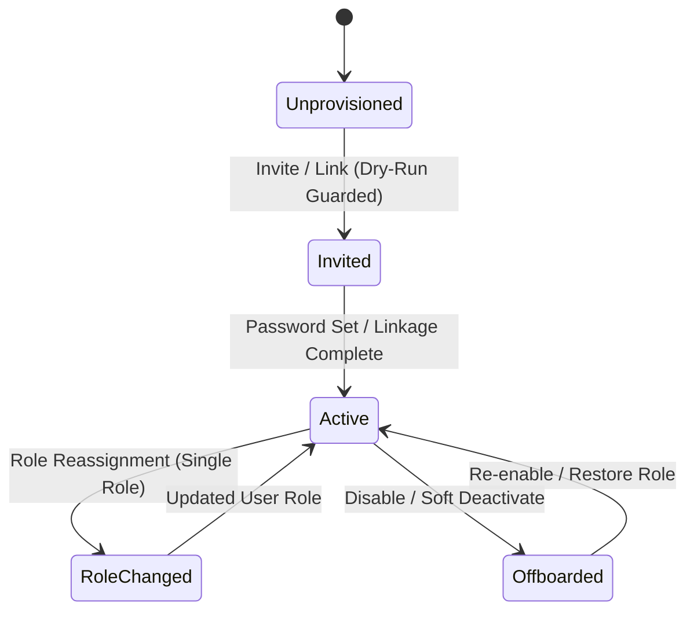

# Staff Lifecycle Architecture & Governance Design

> [!NOTE]
> **DESIGN DOCUMENT ONLY**: Hosted staff provisioning code is **DEFERRED** in this PR. Executable staff provisioning tooling will be implemented in a subsequent security phase after shared-staging database reconciliation and project-owner authorization.

## Core Governance Principles

1. **Historical Attribution Integrity**:
   - `admin_users` profile rows must be preserved indefinitely to maintain audit references in `approval_records` and project change histories.
   - Normal offboarding must **NEVER** delete `admin_users` profile records from the database.
2. **Auth User Preservation**:
   - Auth identities (`auth.users`) are preserved by default during offboarding to prevent broken foreign key references across identity stores.
   - Disabling or revoking access is accomplished by setting `banned_until` or deactivating operational roles, rather than hard-deleting Auth accounts.
3. **Single Operational Role Enforcement**:
   - Each staff identity must hold exactly **one** active operational role (`admin`, `reviewer`, or `editor`) in `user_roles`.
   - Assigning a new role automatically replaces or deactivates any existing role assignments.
4. **Dry-Run by Default**:
   - All CLI staff management tooling must run in dry-run mode unless explicit `--apply` and confirmation flags are passed.
5. **Project-Owner Approval Required**:
   - Modifying staff privileges or provisioning new administrative accounts on shared staging requires prior authorization from project owners.

---

## Controlled Staff Lifecycle Workflows

### 1. Provisioning & Linkage (`create` / `invite` / `link`)
- **Input**: Email, Full Name, Initial Role (`admin`, `reviewer`, `editor`).
- **Preconditions**: Checks for existing `auth.users` identity or `admin_users` profile.
- **Action**: Idempotently creates or links Auth user to `admin_users` profile and assigns a single operational role in `user_roles`.
- **Audit**: Inserts an audit record documenting the provisioning event.

### 2. Role Transition (`reassign`)
- **Input**: Staff Email/ID, New Target Role.
- **Preconditions**: Checks that target staff identity exists and has an active profile.
- **Action**: Transactionally removes existing role assignments in `user_roles` and inserts the new target role.
- **Audit**: Logged as a role transition audit event.

### 3. Offboarding & Access Revocation (`disable` / `deactivate`)
- **Input**: Staff Email/ID.
- **Preconditions**: Confirms staff identity is not the last remaining active system administrator.
- **Action**:
  1. Deactivates role records in `user_roles`.
  2. Sets ban status on `auth.users` identity to prevent future authentication.
  3. Preserves `admin_users` profile row unchanged to maintain historical attribution for all past approvals.
- **Audit**: Logged as an offboarding audit event.

### 4. Anomaly Detection (`audit` / `orphan-check`)
- **Multi-Role Detection**: Identifies any staff identity holding more than one active role in `user_roles`.
- **Orphan Detection**: Identifies `admin_users` profiles without linked Auth identities, or Auth identities missing `admin_users` profiles.
- **Remediation**: Reports anomalies without performing automatic mutations unless explicitly authorized.

---

## Pre-Implementation Requirements

Executable staff provisioning scripts wait for:
1. Complete manual inventory of existing `auth.users`, `admin_users`, and `user_roles` records on shared staging.
2. Confirmation and cleanup of any existing role anomalies or unlinked accounts.
3. Completion of the 7-gate database migration-history reconciliation.
4. Formal project-owner approval of staff management DDL and CLI procedures.
