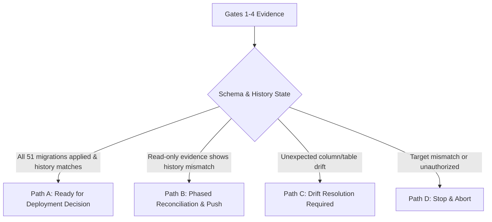

# Staging Database Migration Reconciliation Runbook

> [!CAUTION]
> **STRICT GOVERNANCE DIRECTIVE**: Direct execution of `supabase db push`, `supabase db reset`, `supabase migration repair`, or manual schema mutations against a hosted shared-staging project is **STRICTLY PROHIBITED** until the 7-gate reconciliation procedure is fully completed and explicitly authorized by the project owner.

---

## 1. Context & Governance Baseline

1. **Historical/Paused Staging Origin**: Initial database DDL statements (`0001` through `0006`) were applied manually to the historical paused Supabase instance (`capstone-admin-cms-staging-2026`) using the dashboard SQL Editor. This manual baseline is not the normal state of active staging-v2.
2. **Active staging-v2 Evidence**: Historical point-in-time read-only evidence first recorded 46 tracked rows from `20260601035138` through `20260828120000`; later reviewed evidence recorded 48/48 migrations through `20260831090000_postgres17_maintain_privilege_alignment`. No hosted check in this integration establishes migrations 0049–0051 as deployed.
3. **Evidence Boundary**: The repository contains **exactly 51 migrations** defining 41 public application tables, 3 non-public execution-control tables, 4 storage buckets, 84 service-role application RPC signatures across 83 names, and 4 non-public dispatcher routines. The authenticated-only recovery lookup and separately governed helper grants are not service-role application RPC contracts. The hosted 48/48 evidence predates migrations 0049–0051 and is historical evidence only; it does not prove the current repository schema, constraints, grants, or RPC parity are deployed.
4. **Scope of Migration Repair**: `supabase migration repair` modifies **only the tracking history table** (`supabase_migrations.schema_migrations`). It does not alter database tables, columns, constraints, or RPC functions. It is never routine for active staging-v2: it may be considered only if future read-only reconciliation demonstrates a real history mismatch and separate authorization is granted. `supabase db push` remains governed and must not be run casually.

---

## 2. Expected Repository State (51 Migrations)

### A. Authoritative Migration Inventory

| # | Migration File | Description |
| :--- | :--- | :--- |
| 1 | `20260601035138_staging_schema.sql` | 13 core tables, foreign keys, indexes, and updated_at triggers |
| 2 | `20260601035139_staging_rls_policies.sql` | Restrictive Row Level Security policies on 13 core tables |
| 3 | `20260715102956_admin_auth_identity.sql` | Links `admin_users.auth_user_id` to `auth.users(id)` |
| 4 | `20260719003407_explicit_data_api_grants.sql` | Least-privilege Data API grants (`anon` denied, `authenticated` lookup SELECT only, `service_role` full CRUD) |
| 5 | `20260719165118_initial_admin_bootstrap.sql` | Transactional `bootstrap_initial_admin` function |
| 6 | `20260719165119_fix_initial_admin_bootstrap_runtime.sql` | Corrects bootstrap runtime function using `pg_catalog.btrim` |
| 7 | `20260803174000_harden_function_execute_defaults.sql` | Hardens default function execution privileges |
| 8 | `20260803180000_transactional_review_actions.sql` | Atomic `perform_project_review_action` RPC and approval records audit |
| 9 | `20260808170000_transactional_project_metadata_update.sql` | Atomic `update_project_metadata` RPC for scalar and relationship writes |
| 10 | `20260810090000_atomic_browser_import_metadata_stage.sql` | `stage_browser_import_metadata` RPC and `browser_import_commits` ledger |
| 11 | `20260810120000_atomic_browser_import_media_stage.sql` | `finalize_browser_import_media_stage` RPC and `browser_import_media_commits` ledger |
| 12 | `20260810150000_atomic_import_batch_review_submit.sql` | `submit_import_projects_for_review` RPC with pre-mutation validation |
| 13 | `20260810180000_participant_preview_links.sql` | `participant_previews` table (including `token_hash`) and preview lifecycle RPCs |
| 14 | `20260811090000_participant_preview_confirmations.sql` | `participant_preview_confirmations` table and confirmation RPCs |
| 15 | `20260811120000_participant_preview_correction_requests.sql` | `participant_preview_correction_requests` table and correction request RPC |
| 16 | `20260811130000_participant_preview_correction_resolution.sql` | `start_participant_preview_correction_resolution` RPC and five-/six-parameter preview-generation overloads |
| 17 | `20260811150000_publication_readiness_gate.sql` | `get_project_publication_readiness` RPC and validation gates |
| 18 | `20260811160000_approval_edit_gate.sql` | Approved/published state edit locks in `update_project_metadata` |
| 19 | `20260812120000_controlled_publication_execution.sql` | `publication_attempts` ledger and six-phase reserve/prepare/claim/write/finalize/fail publication RPC protocol |
| 20 | `20260812150000_controlled_public_removal.sql` | `public_removal_attempts` ledger and six-phase reserve/prepare/claim/write/finalize/fail removal RPC protocol |
| 21 | `20260813002154_project_metadata_audit_history.sql` | Detailed metadata diff audit logging in `approval_records.event_details` |
| 22 | `20260813120000_staff_identity_provisioning.sql` | `staff_provisioning_requests` table and staff provisioning state machine RPCs |
| 23 | `20260813180000_participant_preview_email_notifications.sql` | `projects.participant_contact_email` column, `participant_preview_notifications` ledger, and notification RPCs |
| 24 | `20260813190000_participant_preview_reminder_schedules.sql` | `participant_preview_reminder_schedules` table and reminder scheduling RPCs |
| 25 | `20260814090000_accessible_full_text_gate.sql` | Mandatory poster full text (`poster_text_public`) and accessibility text (`accessibility_text_public`) gates |
| 26 | `20260814140000_snapshot_image_alt_text.sql` | Mandatory snapshot image alt text (`media_assets.alt_text_public`) column and gates |
| 27 | `20260816144917_staging_uat_direct_account_finalization.sql` | Atomic staging UAT staff-account finalization with exact identity ownership and non-admin role enforcement |
| 28 | `20260817090000_private_media_approval_gate.sql` | Requires exact private poster media before project approval |
| 29 | `20260819214431_password_recovery_session_provenance.sql` | Durable Auth-session-bound password-recovery provenance and least-privilege RPCs |
| 30 | `20260820120000_assistive_validation_persistence.sql` | Assistive-validation run/finding persistence |
| 31 | `20260820160000_assistive_validation_job_coordination.sql` | Assistive job ownership, fencing, and recovery coordination |
| 32 | `20260821090000_assistive_validation_staff_inspection.sql` | Bounded staff inspection/disposition functions |
| 33 | `20260821140000_assistive_duplicate_shortlist.sql` | Deterministic duplicate-shortlist evidence |
| 34 | `20260824050000_multi_image_gallery.sql` | Ordered multi-image gallery foundation |
| 35 | `20260824055000_snapshot_alt_text_media_identity.sql` | Snapshot alt-text media identity contract |
| 36 | `20260824060000_multi_image_gallery_approval_gate.sql` | Gallery-aware approval gate |
| 37 | `20260824070000_multi_image_gallery_participant_preview.sql` | Gallery-aware participant preview evidence |
| 38 | `20260824080000_multi_image_gallery_publication_readiness.sql` | Gallery-aware publication readiness |
| 39 | `20260824120000_bulk_project_review_concurrency.sql` | Version-fenced bulk-review wrapper |
| 40 | `20260824180000_public_feed_deployment_ledger.sql` | Immutable public deployment versions, membership, head, and operations |
| 41 | `20260824183000_public_feed_writer_protocol.sql` | Unified token/epoch-fenced canonical writer protocol |
| 42 | `20260825025000_multi_image_gallery_review_submission.sql` | Gallery-aware review-submission gates |
| 43 | `20260825030000_public_feed_taxonomy_operation_guard.sql` | Taxonomy write guards during public-feed operations |
| 44 | `20260826090000_public_feed_activation_authority_guard.sql` | Durable activation-authority and projection write fences |
| 45 | `20260828090000_assistive_language_findings.sql` | Assistive language-finding contract |
| 46 | `20260828120000_assistive_worker_heartbeat.sql` | Hosted assistive-worker heartbeat and availability contract |
| 47 | `20260828170000_assistive_execution_control.sql` | Non-public zero-cost executor launch ceiling, reservation fencing, registration, and least-privilege dispatcher contract |
| 48 | `20260831090000_postgres17_maintain_privilege_alignment.sql` | PostgreSQL 17 MAINTAIN revoked from `service_role` on the five tables whose historical `GRANT ALL` predates the privilege |
| 49 | `20260902010606_controlled_project_links_import.sql` | Repository implementation of optional controlled video, demo/prototype, and repository URL workbook intake |
| 50 | `20260903120000_participant_preview_controlled_links.sql` | Repository implementation of controlled-link participant-preview evidence and publication/reconciliation readiness comparison |
| 51 | `20260903130000_participant_owned_corrections.sql` | Repository implementation of immutable participant-owned correction packages, exact-revision review, and recoverable acceptance; hosted deployment is not asserted |

### B. Expected Tables (41 Total)
- **Core Relational (13)**: `programs`, `disciplines`, `industry_categories`, `admin_users`, `user_roles`, `import_batches`, `projects`, `project_disciplines`, `project_industry_categories`, `media_assets`, `validation_flags`, `approval_records`, `published_snapshots`
- **Import Commit Ledgers (2)**: `browser_import_commits`, `browser_import_media_commits`
- **Participant Preview & Correction (7)**: `participant_previews`, `participant_preview_confirmations`, `participant_preview_correction_requests`, `participant_correction_submissions`, `participant_correction_prior_revisions`, `participant_correction_recovery_rows`, `participant_correction_events`. The SHA-256 token is stored in `participant_previews.token_hash`; there is no `participant_preview_tokens` table.
- **Publication State (11)**: `publication_attempts`, `public_removal_attempts`, `public_feed_operations`, `public_feed_versions`, `public_feed_version_members`, `public_feed_head`, `feed_rollback_preparations`, `public_feed_operation_events`, `public_feed_activation_authority`, `public_feed_project_projection_authority`, `public_feed_discipline_projection_authority`
- **Staff Lifecycle (1)**: `staff_provisioning_requests`
- **Auth Session Provenance (1)**: `password_recovery_sessions`
- **Notification & Reminder Ledgers (2)**: `participant_preview_notifications`, `participant_preview_reminder_schedules`
- **Assistive Validation & Worker Operations (4)**: `assistive_validation_runs`, `assistive_validation_findings`, `assistive_validation_jobs`, `assistive_worker_heartbeats`

The separate, non-Data-API `assistive_execution_control` schema contains exactly 3 additional
tables: `launch_budget_guard`, `launch_reservations`, and `executor_registrations`. Gate 4 compares
their columns, constraints, forced RLS state, absence of runtime table grants, and dispatcher schema
grant exactly; they are not part of the 41-table public application inventory.

### C. Expected Storage Buckets (4 Total)
- `project-drafts-private`: Private draft uploads and participant package artifacts.
- `participant-corrections-private`: Private participant-owned and staff-transported source packages.
- `project-public-assets`: Approved public poster and snapshot image assets.
- `public-feeds`: Schema-validated public JSON showcase feed (`capstones-latest.json`).

### D. RPC Contract Basis
The authoritative migration contract contains **84 service-role application RPC signatures across 83 names**. `generate_participant_preview` has distinct overloads. The authenticated-only `get_current_password_recovery_session_state()` lookup and the 4 non-public dispatcher routines are intentionally outside that service-role inventory. Controlled publication/removal and the unified writer protocol remain service-role-only governed contracts. Later `DROP FUNCTION` statements remove obsolete signatures. Exact names, parameters, PostgreSQL types, final grants, and migration bytes are enforced by `hostedDeploymentReadiness.test.ts`; Gate 4 separately compares the dispatcher routines and grants.

### E. Key Column & Constraint Requirements
- `projects.participant_contact_email`: Normalized nullable email address (Migration 0023).
- `projects.poster_text_public`: Required, non-blank after trim, <= 20000 chars (Migration 0025).
- `projects.accessibility_text_public`: Required, non-blank after trim, <= 2000 chars (Migration 0025).
- `media_assets.alt_text_public`: Required for snapshot images, <= 2000 chars (Migration 0026).
- `projects.video_url`, `projects.demo_url`, `projects.repository_url`: Optional controlled URLs populated by normal workbook intake and included in participant-preview evidence (Migrations 0049–0050).

---

## 3. Read-Only Reconciliation Gates (Gates 1–4)

All commands in Gates 1–4 perform read-only inspection. They make zero database or storage changes.

### Gate 1: Toolchain & Working Tree Verification
Verify pinned versions and clean working tree:
```bash
node --version       # Expected: >= 24.14.1 < 25
npm --version        # Expected: >= 11.11.0 < 12
git status --short --untracked-files=no
git rev-parse HEAD   # Verify against origin/main
```

### Gate 2: Read-Only Target Identity & Deployment Readiness
Execute the automated read-only deployment readiness checker:
```bash
npm run check:admin-deployment-readiness
```

Verify the output report:
- `TARGET_IDENTITY_MATCH = YES`
- `MIGRATION_HISTORY_READABLE = NO`
- `REPOSITORY_MIGRATIONS = 51`
- `HOSTED_RECORDED_MIGRATIONS = <count or UNKNOWN>`
- `SCHEMA_BASELINE = UNVERIFIED / INCOMPLETE / DRIFT / UNKNOWN`
- `REQUIRED_RPC_NAMES = PRESENT / INCOMPLETE / UNVERIFIED`
- `REQUIRED_RPC_SIGNATURES = PRESENT / INCOMPLETE / UNVERIFIED`
- `REQUIRED_TABLE_SET = PRESENT / INCOMPLETE / UNVERIFIED`
- `REQUIRED_STORAGE_BUCKETS = PRESENT / INCOMPLETE / UNVERIFIED`
- `AUTH_FOUNDATION = READY / INCOMPLETE / UNVERIFIED`
- `MANUAL_EVIDENCE_REQUIRED = YES`

The checker uses only GET/HEAD requests: zero-row table HEAD probes, aggregate filtered Auth existence counts, storage bucket listing, and a credential-scoped GET of the PostgREST OpenAPI root. It never executes an RPC. OpenAPI proves the callable names for the active role but can collapse overloads, so exact overload evidence remains a Gate 4 responsibility.

Classification is fail-closed:
- `BLOCKED`: target identity fails or read-only inspection cannot initialize.
- `DRIFT_REQUIRES_REVIEW`: OpenAPI proves an unexpected public relation or governed Gate 4 evidence proves schema, constraint, grant, or RPC-signature drift.
- `RECONCILIATION_REQUIRED`: read-only evidence proves a required table, RPC name, bucket, Auth foundation, or recorded migration is missing.
- `MANUAL_EVIDENCE_REQUIRED`: no automated defect is proven, but Gate 3/4 evidence is unavailable or incomplete.
- `READY_FOR_MUTATION_DECISION`: every automated dimension is present and explicit Gate 3/4 evidence proves exact migrations, schema objects, constraints, grants, and RPC signatures. The CLI does not synthesize this manual evidence.

### Gate 3: Read-Only Migration Tracking Audit
Inspect `supabase_migrations.schema_migrations` to determine recorded migration versions:
```sql
-- Read-only SQL query via Supabase Dashboard SQL Editor or CLI
SELECT version, inserted_at
  FROM supabase_migrations.schema_migrations
 ORDER BY version ASC;
```
Record exact count and missing timestamps against the 51 repository migrations.

For active staging-v2, historical point-in-time evidence first recorded 46 rows through `20260828120000` and later recorded 48/48 rows through `20260831090000`. The later evidence predates repository migrations 0049–0051; no hosted deployment of those migrations is asserted. Recheck migration alignment for each release candidate and whenever reconciliation is required; history evidence does not establish exact schema, grant, or RPC parity.

The configured Data API exposes `public`, `graphql_public`, and `storage`, not `supabase_migrations`. Therefore the automated checker truthfully reports `MIGRATION_HISTORY_READABLE = NO` and `HOSTED_RECORDED_MIGRATIONS = UNKNOWN`; this separately governed read-only evidence is mandatory and must not be replaced with a `public.schema_migrations` fallback.

### Gate 4: Hosted vs Repository Schema Evidence

Gate 4 uses one evidence model for both sides of the comparison. The expected side is generated
from the fully migrated repository schema, not from a second hand-maintained DDL specification.

1. Check out the exact reviewed candidate SHA and prove the collector against a disposable Local
   Supabase stack:
   ```bash
   npm run verify:gate4-schema-evidence:disposable
   ```
2. Independently review
   [`gate4-schema-evidence.sql`](./gate4-schema-evidence.sql). It is a single SELECT-only statement
   over `pg_catalog`, `storage.buckets`, and `supabase_migrations.schema_migrations`. It reads no
   application rows, Auth identities, or Storage objects and calls no application RPC.
3. An authorized hosted operator executes that exact reviewed SQL against active staging-v2 and
   saves the single returned `gate4_evidence` JSON value as the immutable snapshot artifact. Record
   environment, UTC collection time, operator role, reviewed query SHA, and artifact reference
   separately; do not add credentials, private connection details, or identities to the artifact.
4. From the same exact candidate checkout, compare the hosted snapshot:
   ```bash
   npm run check:gate4-schema-evidence -- --evidence-file=<snapshot.json> --expected-git-sha=<full-40-hex-reviewed-sha>
   ```
   Add `--machine-readable` for deterministic JSON output.
   The command fails closed if the checkout has tracked staged or unstaged changes; an untracked
   snapshot artifact is allowed because it is input evidence, not repository contract source.

Required result for a current 51-migration candidate: `GATE4_CLASSIFICATION=GATE4_MATCH`, with
`MIGRATIONS=51/51`, `TABLES=44/44`, `RPC_SIGNATURES=84/84`, `RPC_NAMES=83/83`,
`DISPATCHER_CONTROL_ROUTINES=4/4`, `STORAGE_BUCKETS=4/4`, and match classifications for columns,
constraints, RLS, policies, and grants. The table total is 41 public application tables plus 3
non-public execution-control tables. The historical hosted 48/48 result remains evidence for that
earlier repository state, not proof that migrations 0049–0051 are deployed.
`canonical_staff_roles(text[])` is compared as a separate helper and must remain `1/1`; it does not
inflate the application-RPC count.

#### PostgreSQL 17 MAINTAIN drift on the five historical `GRANT ALL` tables

The historical comparison used PostgreSQL 15 Local and PostgreSQL 17 staging-v2, which added the per-table
`MAINTAIN` privilege and includes it in `ALL`. On a PostgreSQL 17 target missing Migration 0048, a Gate 4
comparison will therefore truthfully report `service_role` holding `MAINTAIN` on
`browser_import_commits`, `browser_import_media_commits`, `participant_previews`,
`participant_preview_confirmations` and `participant_preview_correction_requests` where the
PostgreSQL 15 expected side does not. That is genuine engine drift, not a collector defect — do not
filter or normalise `MAINTAIN` out of the evidence to make the comparison match. Applying
Migration 48 to the PostgreSQL 17 target removes exactly that privilege for exactly that role on
exactly those five tables and the differences disappear; the other seven privileges are unaffected.

If an authorized operator ever needs to reverse this hardening on PostgreSQL 17+, the narrow manual
inverse is `GRANT MAINTAIN` on those same five tables to `service_role`. It is a privilege-only
change and is unrelated to application-data recovery.

The comparator fails closed as `EVIDENCE_INVALID` for a missing category, malformed value, or
duplicate catalog identity. A valid mismatch is `GATE4_DRIFT` and reports missing, unexpected, or
changed catalog keys without dumping the full snapshot. Covered evidence includes exact public
table set; all table columns and types/arrays/nullability/identity/generated/default behavior;
primary, unique, foreign-key, and check constraints; RLS/FORCE RLS and policies; relevant
table/schema privileges; relevant role structure, including the dedicated dispatcher; exposed and
non-public function arguments, return types, security mode/configuration and execute grants; Auth
linkage structure; and complete canonical bucket visibility/limits/MIME configuration.

`GATE4_MATCH` proves only structural parity for the collected database contract at the recorded
Git SHA. It does not prove application data, Auth identities, Storage object contents, workflow
behavior, backup/restore, deployment identity, monitoring, or UAT. Migration-history equality is
necessary but never sufficient. Gate 4 is read-only and does not authorize Gate 6, migration
repair, `db push`, data changes, Storage changes, or any other hosted mutation.

---

## 4. Decision Gate (Gate 5)

Evaluate empirical evidence from Gates 1–4 to determine the required path:



- **Path A (Full Match / Ready)**: All 51 migrations, 41 public application tables, 3 non-public execution-control tables, 84 service-role application RPC signatures across 83 names, 4 dispatcher routines, 4 canonical buckets, exact constraints/grants, and absence of unexpected schema objects are verified by combined automated and governed manual evidence. This is the current repository acceptance requirement, not a hosted deployment claim. Proceed directly to Gate 7 verification.
- **Path B (Phased Reconciliation / Conditional)**: Future read-only evidence shows a real history mismatch or missing forward migration; any repair or migration application requires separate authorization. Proceed to Gate 6 only after that authorization.
- **Path C (Drift Detected)**: Unrecognized columns, conflicting constraint names, or manual schema changes detected. STOP. Document drift and formulate an explicit resolution plan.
- **Path D (Abort)**: Target identity mismatch or lack of operator authorization. STOP immediately.

---

## 5. Separately Authorized Mutating Gates (Gates 6–7)

> [!WARNING]
> **EXPLICIT PROJECT-OWNER APPROVAL REQUIRED**
> The commands below modify database tables or migration tracking records. They must never be executed autonomously.

These mutating gates are conditional and are not routine maintenance for active staging-v2. Its historical 46-row observation was followed by 48/48 evidence; deployment of repository migrations 0049–0051 remains unasserted here. Missing forward migrations are not tracking-history defects. Do not use migration repair merely to make a count match; first obtain read-only evidence of a real history mismatch and separate authorization.

### Gate 6: Separately Authorized Reconciliation & Migration

#### Step 6.1: Repair Tracking History for a Historical Baseline (Conditional)
The following example applies to the historical paused staging instance (`capstone-admin-cms-staging-2026`) when its manually applied baseline is confirmed. For any target, including active staging-v2, `supabase migration repair` may be considered only after future read-only reconciliation demonstrates a real history mismatch and separate authorization is granted. Do not run it on active staging-v2 based on the old manual-repair background or its historical 46-row evidence.
```bash
# REQUIRES EXPLICIT AUTHORIZATION
# Mark migrations 0001-0006 as applied in tracking table
supabase migration repair --status applied 20260601035138 --workdir infra
supabase migration repair --status applied 20260601035139 --workdir infra
supabase migration repair --status applied 20260715102956 --workdir infra
supabase migration repair --status applied 20260719003407 --workdir infra
supabase migration repair --status applied 20260719165118 --workdir infra
supabase migration repair --status applied 20260719165119 --workdir infra
```

#### Step 6.2: Apply Missing Forward Migrations (Conditional)
Only when future read-only evidence demonstrates genuinely missing repository migrations, and after separate authorization and a reviewed mutation plan, apply forward migrations in deterministic sequence:
```bash
# REQUIRES EXPLICIT AUTHORIZATION
supabase db push --workdir infra
```

### Gate 7: Post-Reconciliation Verification

1. Re-run read-only deployment readiness checker:
   ```bash
   npm run check:admin-deployment-readiness
   ```
   *Required automated result: no proven missing objects or drift, normally `DEPLOYMENT_CLASSIFICATION = MANUAL_EVIDENCE_REQUIRED`. Combine it with completed Gate 3/4 evidence before any human `READY_FOR_MUTATION_DECISION`; the automated checker alone cannot assert readiness.*

2. Verify authentication linkage:
   ```bash
   npm run check:admin-auth
   ```
   *Required result: `classification=READY_FOR_MANUAL_LOGIN_TEST`.*

3. Verify the distinct application liveness and deployment-readiness routes:
   ```bash
   curl -s https://<staging-domain>/api/health
   curl -s https://<staging-domain>/api/readiness
   ```
   *Required results: liveness returns HTTP 200 with `status: "ok"`; readiness returns HTTP 200 with `classification: "READY"`. Readiness does not replace the migration/schema evidence above.*

---

## 6. Incident Response & Contained Error Handling

If any unexpected error occurs during reconciliation:
1. **Stop Immediately**: Cease all CLI execution. Do not retry `db push` or `migration repair`.
2. **Preserve Logs Privately**: Capture terminal output without disclosing secret keys or connection strings.
3. **Check Application Health**: Probe `/api/health` to assess operational availability.
4. **Isolate Scope**: Determine whether discrepancies are confined to `schema_migrations` or affect table data.
5. **Report to Project Owner**: Provide empirical output classification for remediation approval.
