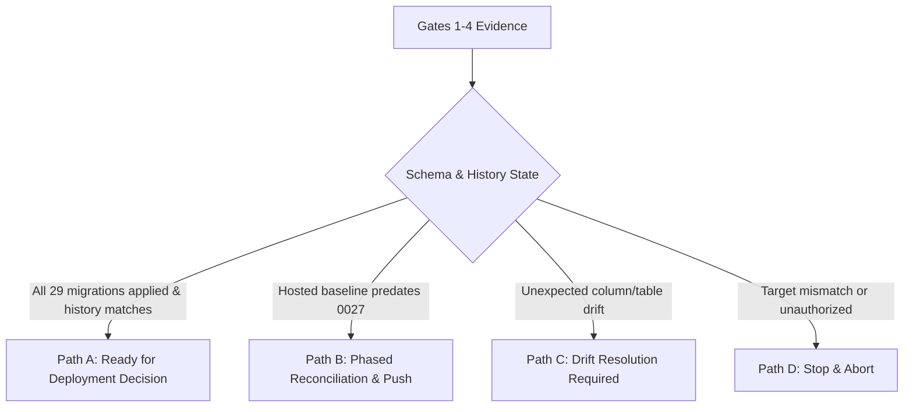

# Staging Database Migration Reconciliation Runbook

> [!CAUTION]
> **STRICT GOVERNANCE DIRECTIVE**: Direct execution of `supabase db push`, `supabase db reset`, `supabase migration repair`, or manual schema mutations against a hosted shared-staging project is **STRICTLY PROHIBITED** until the 7-gate reconciliation procedure is fully completed and explicitly authorized by the project owner.

---

## 1. Context & Governance Baseline

1. **Historical Staging Origin**: Initial database DDL statements (`0001` through `0006`) were applied manually to the isolated hosted Supabase instance (`capstone-admin-cms-staging-2026`) using the dashboard SQL Editor.
2. **Migration Tracking State**: Because early migrations were manually applied, remote migration tracking (`supabase_migrations.schema_migrations`) may be unpopulated or contain legacy version numbers. Running `supabase db push` without prior reconciliation risks re-executing DDL against existing tables (`relation already exists`).
3. **Repository State vs Hosted State**: The repository contains **exactly 29 migrations** defining 24 public application tables, 3 storage buckets, and 44 service-role application RPC signatures across 43 names. The authenticated-only recovery lookup and the separate `canonical_staff_roles(text[])` grant are not service-role application RPC contracts. Hosted evidence predates Migration `0027`; migrations `0007` through `0029` remain repository/local-only until separately authorized reconciliation.
4. **Scope of Migration Repair**: `supabase migration repair` modifies **only the tracking history table** (`supabase_migrations.schema_migrations`). It does not alter database tables, columns, constraints, or RPC functions.

---

## 2. Expected Repository State (29 Migrations)

### A. Authoritative Migration Inventory

| # | Migration File | Description |
| :--- | :--- | :--- |
| 1 | `20260601035138_staging_schema.sql` | 13 core tables, foreign keys, indexes, and updated_at triggers |
| 2 | `20260601035139_staging_rls_policies.sql` | Restrictive Row Level Security policies on 13 core tables |
| 3 | `20260715102956_admin_auth_identity.sql` | Links `admin_users.auth_user_id` to `auth.users(id)` |
| 4 | `20260719003407_explicit_data_api_grants.sql` | Least-privilege Data API grants (`anon` denied, `authenticated` lookup SELECT only, `service_role` full CRUD) |
| 5 | `20260719165118_initial_admin_bootstrap.sql` | Transactional `bootstrap_initial_admin` function |
| 6 | `20260719165119_fix_initial_admin_bootstrap_runtime.sql` | Corrects bootstrap runtime function using `pg_catalog.btrim` |
| 7 | `20260803174000_harden_function_execute_defaults.sql` | Hardens default function execution privileges |
| 8 | `20260803180000_transactional_review_actions.sql` | Atomic `perform_project_review_action` RPC and approval records audit |
| 9 | `20260808170000_transactional_project_metadata_update.sql` | Atomic `update_project_metadata` RPC for scalar and relationship writes |
| 10 | `20260810090000_atomic_browser_import_metadata_stage.sql` | `stage_browser_import_metadata` RPC and `browser_import_commits` ledger |
| 11 | `20260810120000_atomic_browser_import_media_stage.sql` | `finalize_browser_import_media_stage` RPC and `browser_import_media_commits` ledger |
| 12 | `20260810150000_atomic_import_batch_review_submit.sql` | `submit_import_projects_for_review` RPC with pre-mutation validation |
| 13 | `20260810180000_participant_preview_links.sql` | `participant_previews` table (including `token_hash`) and preview lifecycle RPCs |
| 14 | `20260811090000_participant_preview_confirmations.sql` | `participant_preview_confirmations` table and confirmation RPCs |
| 15 | `20260811120000_participant_preview_correction_requests.sql` | `participant_preview_correction_requests` table and correction request RPC |
| 16 | `20260811130000_participant_preview_correction_resolution.sql` | `start_participant_preview_correction_resolution` RPC and five-/six-parameter preview-generation overloads |
| 17 | `20260811150000_publication_readiness_gate.sql` | `get_project_publication_readiness` RPC and validation gates |
| 18 | `20260811160000_approval_edit_gate.sql` | Approved/published state edit locks in `update_project_metadata` |
| 19 | `20260812120000_controlled_publication_execution.sql` | `publication_attempts` ledger and six-phase reserve/prepare/claim/write/finalize/fail publication RPC protocol |
| 20 | `20260812150000_controlled_public_removal.sql` | `public_removal_attempts` ledger and six-phase reserve/prepare/claim/write/finalize/fail removal RPC protocol |
| 21 | `20260813002154_project_metadata_audit_history.sql` | Detailed metadata diff audit logging in `approval_records.event_details` |
| 22 | `20260813120000_staff_identity_provisioning.sql` | `staff_provisioning_requests` table and staff provisioning state machine RPCs |
| 23 | `20260813180000_participant_preview_email_notifications.sql` | `projects.participant_contact_email` column, `participant_preview_notifications` ledger, and notification RPCs |
| 24 | `20260813190000_participant_preview_reminder_schedules.sql` | `participant_preview_reminder_schedules` table and reminder scheduling RPCs |
| 25 | `20260814090000_accessible_full_text_gate.sql` | Mandatory poster full text (`poster_text_public`) and accessibility text (`accessibility_text_public`) gates |
| 26 | `20260814140000_snapshot_image_alt_text.sql` | Mandatory snapshot image alt text (`media_assets.alt_text_public`) column and gates |
| 27 | `20260816144917_staging_uat_direct_account_finalization.sql` | Atomic staging UAT staff-account finalization with exact identity ownership and non-admin role enforcement |
| 28 | `20260817090000_private_media_approval_gate.sql` | Requires exact private poster media before project approval |
| 29 | `20260819214431_password_recovery_session_provenance.sql` | Durable Auth-session-bound password-recovery provenance and least-privilege RPCs |

### B. Expected Tables (24 Total)
- **Core Relational (13)**: `programs`, `disciplines`, `industry_categories`, `admin_users`, `user_roles`, `import_batches`, `projects`, `project_disciplines`, `project_industry_categories`, `media_assets`, `validation_flags`, `approval_records`, `published_snapshots`
- **Import Commit Ledgers (2)**: `browser_import_commits`, `browser_import_media_commits`
- **Participant Preview & Correction (3)**: `participant_previews`, `participant_preview_confirmations`, `participant_preview_correction_requests`. The SHA-256 token is stored in `participant_previews.token_hash`; there is no `participant_preview_tokens` table.
- **Publication State (2)**: `publication_attempts`, `public_removal_attempts`
- **Staff Lifecycle (1)**: `staff_provisioning_requests`
- **Auth Session Provenance (1)**: `password_recovery_sessions`
- **Notification & Reminder Ledgers (2)**: `participant_preview_notifications`, `participant_preview_reminder_schedules`

### C. Expected Storage Buckets (3 Total)
- `project-drafts-private`: Private draft uploads and participant package artifacts.
- `project-public-assets`: Approved public poster and snapshot image assets.
- `public-feeds`: Schema-validated public JSON showcase feed (`capstones-latest.json`).

### D. RPC Contract Basis
The authoritative migration contract contains **44 service-role application RPC signatures across 43 names**. `generate_participant_preview` has distinct five- and six-parameter overloads. The authenticated-only `get_current_password_recovery_session_state()` lookup is intentionally outside that service-role inventory. Controlled publication and removal each use six phase-specific functions; there is no `execute_controlled_publication` or `execute_controlled_public_removal` function. Later `DROP FUNCTION` statements remove obsolete `update_project_metadata` signatures. The exact names, parameter names, and PostgreSQL types are enforced by `hostedDeploymentReadiness.test.ts` against final migration grants and definitions.

### E. Key Column & Constraint Requirements
- `projects.participant_contact_email`: Normalized nullable email address (Migration 0023).
- `projects.poster_text_public`: Required, non-blank after trim, <= 20000 chars (Migration 0025).
- `projects.accessibility_text_public`: Required, non-blank after trim, <= 2000 chars (Migration 0025).
- `media_assets.alt_text_public`: Required for snapshot images, <= 2000 chars (Migration 0026).

---

## 3. Read-Only Reconciliation Gates (Gates 1–4)

All commands in Gates 1–4 perform read-only inspection. They make zero database or storage changes.

### Gate 1: Toolchain & Working Tree Verification
Verify pinned versions and clean working tree:
```bash
node --version       # Expected: >= 24.14.1 < 25
npm --version        # Expected: >= 11.11.0 < 12
git status --short --untracked-files=no
git rev-parse HEAD   # Verify against origin/main
```

### Gate 2: Read-Only Target Identity & Deployment Readiness
Execute the automated read-only deployment readiness checker:
```bash
npm run check:admin-deployment-readiness
```

Verify the output report:
- `TARGET_IDENTITY_MATCH = YES`
- `MIGRATION_HISTORY_READABLE = NO`
- `REPOSITORY_MIGRATIONS = 26`
- `HOSTED_RECORDED_MIGRATIONS = <count or UNKNOWN>`
- `SCHEMA_BASELINE = UNVERIFIED / INCOMPLETE / DRIFT / UNKNOWN`
- `REQUIRED_RPC_NAMES = PRESENT / INCOMPLETE / UNVERIFIED`
- `REQUIRED_RPC_SIGNATURES = PRESENT / INCOMPLETE / UNVERIFIED`
- `REQUIRED_TABLE_SET = PRESENT / INCOMPLETE / UNVERIFIED`
- `REQUIRED_STORAGE_BUCKETS = PRESENT / INCOMPLETE / UNVERIFIED`
- `AUTH_FOUNDATION = READY / INCOMPLETE / UNVERIFIED`
- `MANUAL_EVIDENCE_REQUIRED = YES`

The checker uses only GET/HEAD requests: zero-row table HEAD probes, aggregate filtered Auth existence counts, storage bucket listing, and a credential-scoped GET of the PostgREST OpenAPI root. It never executes an RPC. OpenAPI proves the callable names for the active role but can collapse overloads, so exact overload evidence remains a Gate 4 responsibility.

Classification is fail-closed:
- `BLOCKED`: target identity fails or read-only inspection cannot initialize.
- `DRIFT_REQUIRES_REVIEW`: OpenAPI proves an unexpected public relation or governed Gate 4 evidence proves schema, constraint, grant, or RPC-signature drift.
- `RECONCILIATION_REQUIRED`: read-only evidence proves a required table, RPC name, bucket, Auth foundation, or recorded migration is missing.
- `MANUAL_EVIDENCE_REQUIRED`: no automated defect is proven, but Gate 3/4 evidence is unavailable or incomplete.
- `READY_FOR_MUTATION_DECISION`: every automated dimension is present and explicit Gate 3/4 evidence proves exact migrations, schema objects, constraints, grants, and RPC signatures. The CLI does not synthesize this manual evidence.

### Gate 3: Read-Only Migration Tracking Audit
Inspect `supabase_migrations.schema_migrations` to determine recorded migration versions:
```sql
-- Read-only SQL query via Supabase Dashboard SQL Editor or CLI
SELECT version, inserted_at
  FROM supabase_migrations.schema_migrations
 ORDER BY version ASC;
```
Record exact count and missing timestamps against the 27 repository migrations.

The configured Data API exposes `public`, `graphql_public`, and `storage`, not `supabase_migrations`. Therefore the automated checker truthfully reports `MIGRATION_HISTORY_READABLE = NO` and `HOSTED_RECORDED_MIGRATIONS = UNKNOWN`; this separately governed read-only evidence is mandatory and must not be replaced with a `public.schema_migrations` fallback.

### Gate 4: Hosted vs Repository Schema Evidence
Perform read-only inspection of hosted tables, columns, and RPC functions:
1. Verify presence of 13 core tables vs 10 post-0006 extended tables.
2. Verify presence of `alt_text_public` column in `media_assets`.
3. Verify presence of `poster_text_public` and `accessibility_text_public` in `projects`.
4. Verify all 43 service-role application RPC signatures, including both preview overloads, both six-phase publication/removal protocols, and direct UAT staff-account finalization.
5. Verify exact constraints, grants, Row Level Security, and the absence of unexpected schema objects across all existing tables.

---

## 4. Decision Gate (Gate 5)

Evaluate empirical evidence from Gates 1–4 to determine the required path:



- **Path A (Full Match / Ready)**: All 29 migrations, 24 public application tables, 44 service-role application RPC signatures, exact constraints/grants, and absence of unexpected schema objects are verified by combined automated and governed manual evidence. Proceed directly to Gate 7 verification.
- **Path B (Phased Reconciliation / Staging Standard)**: Hosted migration evidence predates Migration `0027`; any missing forward migrations through `0028` require separately authorized application. Proceed to Gate 6.
- **Path C (Drift Detected)**: Unrecognized columns, conflicting constraint names, or manual schema changes detected. STOP. Document drift and formulate an explicit resolution plan.
- **Path D (Abort)**: Target identity mismatch or lack of operator authorization. STOP immediately.

---

## 5. Separately Authorized Mutating Gates (Gates 6–7)

> [!WARNING]
> **EXPLICIT PROJECT-OWNER APPROVAL REQUIRED**
> The commands below modify database tables or migration tracking records. They must never be executed autonomously.

### Gate 6: Separately Authorized Reconciliation & Migration

#### Step 6.1: Repair Tracking History for Existing Baseline (Conditional)
If hosted database already has early migrations 0001–0006 applied manually:
```bash
# REQUIRES EXPLICIT AUTHORIZATION
# Mark migrations 0001-0006 as applied in tracking table
supabase migration repair --status applied 20260601035138 --workdir infra
supabase migration repair --status applied 20260601035139 --workdir infra
supabase migration repair --status applied 20260715102956 --workdir infra
supabase migration repair --status applied 20260719003407 --workdir infra
supabase migration repair --status applied 20260719165118 --workdir infra
supabase migration repair --status applied 20260719165119 --workdir infra
```

#### Step 6.2: Apply Forward Migrations (0007–0028) (Conditional)
Once baseline tracking is aligned, apply forward migrations in deterministic sequence:
```bash
# REQUIRES EXPLICIT AUTHORIZATION
supabase db push --workdir infra
```

### Gate 7: Post-Reconciliation Verification

1. Re-run read-only deployment readiness checker:
   ```bash
   npm run check:admin-deployment-readiness
   ```
   *Required automated result: no proven missing objects or drift, normally `DEPLOYMENT_CLASSIFICATION = MANUAL_EVIDENCE_REQUIRED`. Combine it with completed Gate 3/4 evidence before any human `READY_FOR_MUTATION_DECISION`; the automated checker alone cannot assert readiness.*

2. Verify authentication linkage:
   ```bash
   npm run check:admin-auth
   ```
   *Required result: `classification=READY_FOR_MANUAL_LOGIN_TEST`.*

3. Verify the distinct application liveness and deployment-readiness routes:
   ```bash
   curl -s https://<staging-domain>/api/health
   curl -s https://<staging-domain>/api/readiness
   ```
   *Required results: liveness returns HTTP 200 with `status: "ok"`; readiness returns HTTP 200 with `classification: "READY"`. Readiness does not replace the migration/schema evidence above.*

---

## 6. Incident Response & Contained Error Handling

If any unexpected error occurs during reconciliation:
1. **Stop Immediately**: Cease all CLI execution. Do not retry `db push` or `migration repair`.
2. **Preserve Logs Privately**: Capture terminal output without disclosing secret keys or connection strings.
3. **Check Application Health**: Probe `/api/health` to assess operational availability.
4. **Isolate Scope**: Determine whether discrepancies are confined to `schema_migrations` or affect table data.
5. **Report to Project Owner**: Provide empirical output classification for remediation approval.
